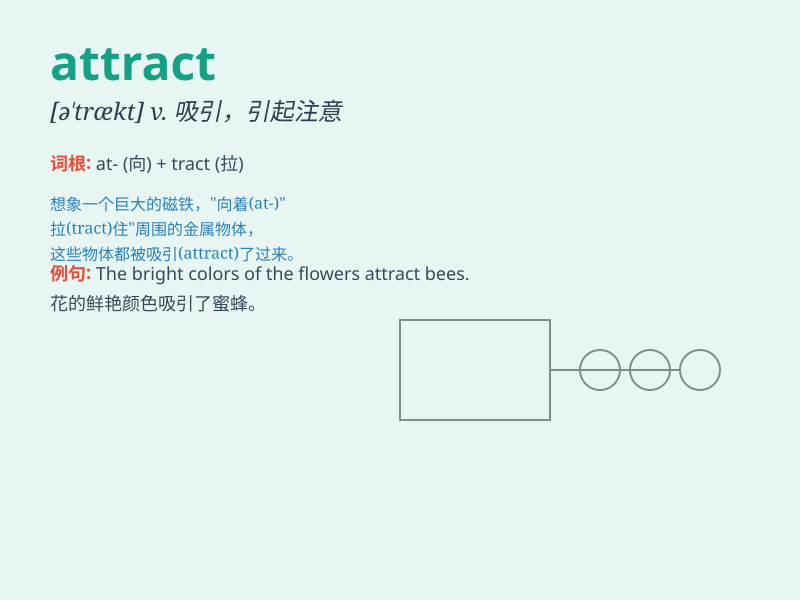

## attract

**英音:** _[ə\'trækt]_ **美音:** _[ə\'trækt]_

**译义:** *vt.吸引vi.有吸引力,引起注意*

### 短语

+ **attract attention:** _引起注意_

+ **attract customers:** _吸引顾客_

+ **attract investment:** _吸引投资_

+ **attract tourists:** _吸引游客_

+ **attract criticism:** _招致批评_

### 例句

#### 例句1

> **The beautiful scenery attracts many tourists every year.**

**中文翻译:** 美丽的风景每年吸引许多游客。

**单词释义:** 吸引

#### 例句2

> **She tried to attract his attention by waving her hand.**

**中文翻译:** 她试图通过挥手来吸引他的注意。

**单词释义:** 引起（注意）

#### 例句3

> **The new shopping mall attracts a large number of customers.**

**中文翻译:** 新的购物中心吸引了大量的顾客。

**单词释义:** 吸引

### 背诵小故事

> A beautiful butterfly with colorful wings attracts many children in
the garden. They all run towards it, drawn by its charm. Just like this,
\'attract\' means to draw someone or something towards you.

**一只拥有彩色翅膀的美丽蝴蝶在花园里吸引了许多孩子。他们都朝它跑去，被它的魅力所吸引。就像这样，'attract'意思是吸引某人或某物朝向你。**

### 图义

