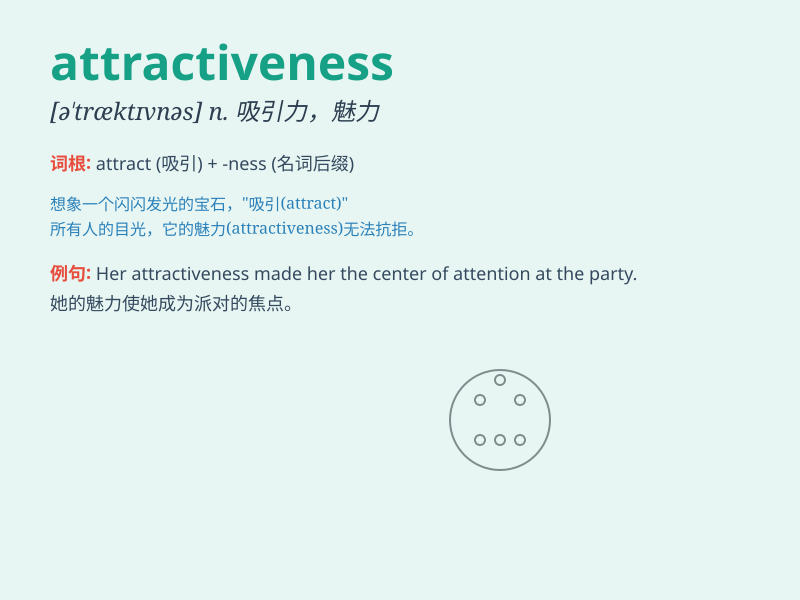

## attractiveness

**英音:** _[ətˈtræktɪvnəs]_ **美音:** _[ətˈtræktɪvnəs]_

**译义:** *n. 吸引力；有吸引力；迷人之处*

### 短语

+ **physical attractiveness:** _外表吸引力_

+ **sexual attractiveness:** _性吸引力_

+ **overall attractiveness:** _整体吸引力_

+ **personal attractiveness:** _个人魅力_

+ **visual attractiveness:** _视觉吸引力_

### 例句

#### 例句1

> **The attractiveness of this city lies in its historical
architecture.**

**中文翻译:** 这座城市的吸引力在于它的历史建筑。

**单词释义:** 吸引力

#### 例句2

> **Her attractiveness is not only in her appearance but also in her
personality.**

**中文翻译:** 她的魅力不仅在于她的外表，还在于她的性格。

**单词释义:** 魅力；吸引力

#### 例句3

> **The new product\'s attractiveness has drawn a lot of
customers.**

**中文翻译:** 新产品的吸引力吸引了很多顾客。

**单词释义:** 吸引力

### 背诵小故事

> Once upon a time, there was a beautiful garden. Its flowers and trees
had a special charm, or attractiveness, that drew people from far and
wide. The garden\'s attractiveness made it a favorite place for all.

**从前，有一个美丽的花园。它的花和树有一种特殊的魅力，即吸引力，吸引着来自四面八方的人们。花园的吸引力使它成为所有人最喜欢的地方。**

### 图义

