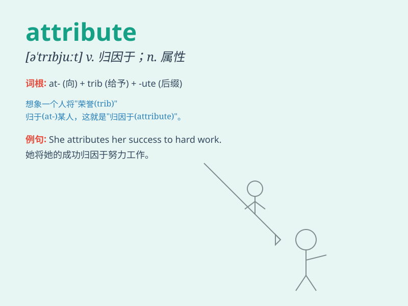

## attribute

**英音:** _[(for n.) ˈatrɪbjuːt; (for v.) əˈtrɪbjuːt]_
**美音:** _[(for n.) ˈætrəˌbjut; (for v.) əˈtrɪbjut]_

**译义:** *n.属性,品质,特征,加于,归结于*

### 短语

+ **attribute to:** _把...归因于；认为...属于_

+ **attribute sth. to sb.:** _把某事归功于某人_

+ **attribute success to hard work:** _把成功归因于努力工作_

+ **attribute importance to sth.:** _认为某事重要_

+ **attribute a quality to sb./sth.:**
_认为某人/某物具有某种品质_

### 例句

#### 例句1

> **We attribute his success to hard work and determination.**

**中文翻译:** 我们把他的成功归因于努力工作和决心。

**单词释义:** 把\...\...归因于

#### 例句2

> **The scientist attributes the phenomenon to a new discovery.**

**中文翻译:** 这位科学家把这种现象归因于一项新的发现。

**单词释义:** 把\...\...归因于

#### 例句3

> **She attributes her good health to a balanced diet and regular
exercise.**

**中文翻译:** 她把自己的健康归功于均衡的饮食和经常锻炼。

**单词释义:** 把\...\...归功于

### 背诵小故事

> A brave knight was known for his excellent swordsmanship. People
attribute his success to his daily practice. One day, a young warrior
asked him the secret, and the knight said, \'It\'s the attribute of hard
work.\'

**一位勇敢的骑士以其精湛的剑术而闻名。人们将他的成功归因于他的日常练习。有一天，一位年轻的战士问他秘诀，骑士说：'这是努力的属性。'**

### 图义

