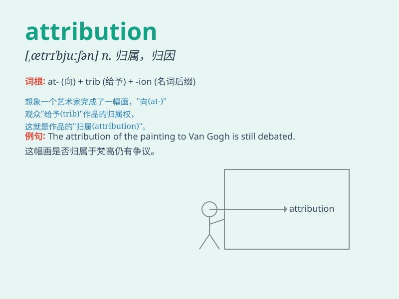

## attribution

**英音:** _[,ætrɪ\'bjuːʃən]_ **美音:** _[,ætrə\'bjʊʃən]_

**译义:** *n.归因*

### 短语

+ **attribution theory:** _归因理论_

+ **attribution bias:** _归因偏差_

+ **source attribution:** _来源归因_

+ **attribution analysis:** _归因分析_

+ **attribution error:** _归因错误_

### 例句

#### 例句1

> **The attribution of this success to teamwork is widely
accepted.**

**中文翻译:** 将这次成功归因于团队合作被广泛认可。

**单词释义:** 归因；归属

#### 例句2

> **The attribution of the painting to a famous artist increased its
value.**

**中文翻译:**
这幅画被认定为出自一位著名艺术家之手，从而提高了它的价值。

**单词释义:** 归属；认定

#### 例句3

> **Attribution of the crime to the suspect is still under
investigation.**

**中文翻译:** 将这一罪行归咎于该嫌疑人仍在调查中。

**单词释义:** 归咎；归因

### 背诵小故事

> A detective was solving a mystery. The success was due to the
accurate attribution of clues. He carefully linked each piece of
evidence to find the criminal. Attribution here means assigning or
crediting something to a particular cause or source.

**一位侦探正在破解一个谜团。成功得益于对线索的准确归因。他仔细地将每一条证据联系起来以找到罪犯。这里的attribution意思是把某事归因于某一特定原因或来源。**

### 图义

