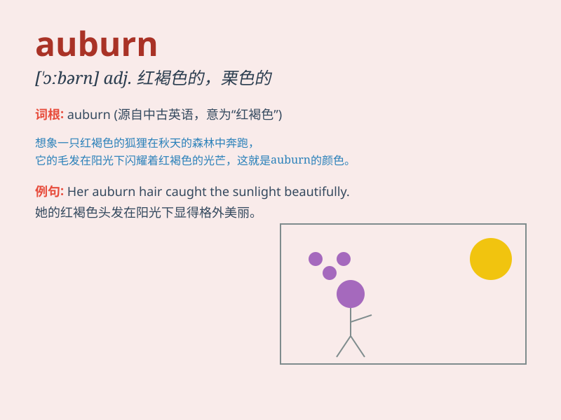

## auburn

**英音:** _[\'ɔːbən; \'ɔːbɜːn]_ **美音:** _[\'ɔbɚn]_

**译义:** *n.赤褐色adj.赤褐色的*

### 短语

+ **auburn hair:** _赤褐色的头发_

+ **auburn locks:** _赤褐色的卷发_

+ **auburn tresses:** _赤褐色的长发_

+ **auburn shade:** _赤褐色色调_

+ **auburn hue:** _赤褐色色泽_

### 例句

#### 例句1

> **She has beautiful auburn hair.**

**中文翻译:** 她有一头漂亮的赤褐色头发。

**单词释义:** 赤褐色的

#### 例句2

> **The autumn leaves turned auburn in the sunlight.**

**中文翻译:** 秋天的树叶在阳光下变成了赤褐色。

**单词释义:** 赤褐色的

#### 例句3

> **His eyes were a deep auburn color.**

**中文翻译:** 他的眼睛是深深的赤褐色。

**单词释义:** 赤褐色的

### 背诵小故事

> A girl named Auburn had beautiful hair of a special color. It was a
mix of brown and red, just like the meaning of the word \'auburn\'.
People always praised her unique and charming auburn hair.

**一个叫奥本的女孩有着漂亮的特殊发色。它是棕色和红色的混合，就像'auburn'这个词的意思。人们总是称赞她独特迷人的赤褐色头发。**

### 图义

