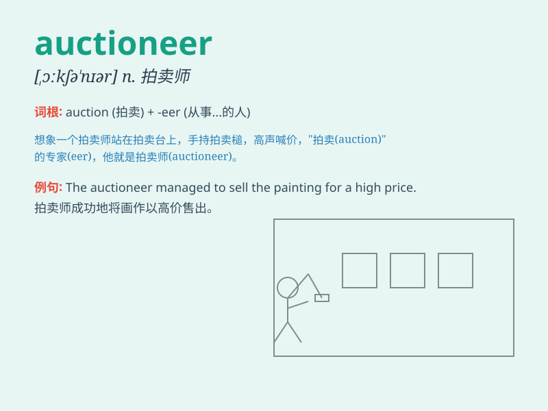

## auctioneer

**英音:** _[ɔːkʃə\'nɪə]_ **美音:** _[,ɔkʃə\'nɪr]_

**译义:** *n.拍卖人vt.拍卖*

### 短语

+ **auctioneer\'s hammer:** _拍卖师的锤子_

+ **professional auctioneer:** _专业拍卖师_

+ **auctioneer\'s fee:** _拍卖师的费用_

+ **auctioneer\'s chant:** _拍卖师的叫价声_

+ **auctioneer\'s podium:** _拍卖师的讲台_

### 例句

#### 例句1

> **The auctioneer called out the bids loudly.**

**中文翻译:** 拍卖师大声喊出出价。

**单词释义:** 拍卖师

#### 例句2

> **The experienced auctioneer handled the sale smoothly.**

**中文翻译:** 这位经验丰富的拍卖师顺利地处理了这次销售。

**单词释义:** 拍卖师

#### 例句3

> **The auctioneer\'s hammer fell, indicating the sale was
complete.**

**中文翻译:** 拍卖师的锤子落下，表明销售完成。

**单词释义:** 拍卖师

### 背诵小故事

> One day, at a lively market, an auctioneer stood on a stage, shouting
loudly and skillfully conducting the auction. People gathered around,
excitedly waiting for their chance to bid. The auctioneer\'s enthusiasm
made the event a huge success.

**有一天，在一个热闹的市场，一位拍卖师站在舞台上，大声喊叫着，熟练地主持拍卖。人们围聚在周围，兴奋地等待着出价的机会。拍卖师的热情使这次活动取得了巨大成功。**

### 图义

