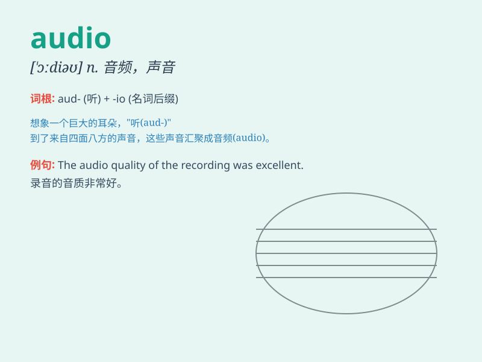

## audio

**英音:** _[\'ɔːdɪəʊ]_ **美音:** _[\'ɔdɪo]_

**译义:** *adj.音频的,声频的,声音的*

### 短语

+ **audio signal:** _音频信号_

+ **audio equipment:** _音频设备_

+ **audio book:** _有声读物_

+ **audio recording:** _录音；音频录制_

+ **audio system:** _音响系统；音频系统_

### 例句

#### 例句1

> **The audio quality of this recording is excellent.**

**中文翻译:** 这段录音的音频质量非常好。

**单词释义:** 音频；声音

#### 例句2

> **She turned up the audio on the TV.**

**中文翻译:** 她把电视的音量调大了。

**单词释义:** 声音；音频

#### 例句3

> **The audio system in the car needs to be repaired.**

**中文翻译:** 汽车里的音响系统需要修理。

**单词释义:** 音响；音频设备

### 背诵小故事

> A group of friends was lost in a forest. They had no map but found an
audio device. With its help, they heard directions and safely got out.
\'Audio\' means related to sound or hearing.

**一群朋友在森林里迷路了。他们没有地图，但找到了一个音频设备。在它的帮助下，他们听到了指示，安全地走了出来。\'audio\'意思是与声音或听觉有关。**

### 图义

