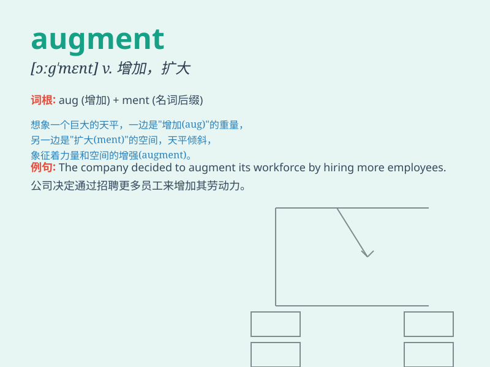

## augment

**英音:** _[ɔːg\'ment]_ **美音:** _[ɔɡ\'mɛnt]_

**译义:** *v.增加,增大n.增加*

### 短语

+ **augment reality:** _增强现实_

+ **augment income:** _增加收入_

+ **augment power:** _增强力量_

+ **augment knowledge:** _增长知识_

+ **augment staff:** _扩充员工_

### 例句

#### 例句1

> **The company decided to augment its workforce by hiring more
employees.**

**中文翻译:** 公司决定通过雇用更多员工来扩充其劳动力。

**单词释义:** 扩充；增加

#### 例句2

> **She augmented her income by doing part-time jobs.**

**中文翻译:** 她通过做兼职工作增加了收入。

**单词释义:** 增加

#### 例句3

> **The new software is designed to augment the functionality of the
existing system.**

**中文翻译:** 新软件旨在增强现有系统的功能。

**单词释义:** 增强

### 背诵小故事

>
想象一个国王的财富原本就很多，但他还想让财富进一步增加。于是他不断收集珍贵的宝石和黄金来
augment 自己的财富。最终，他的财富变得更加庞大。

**想象一位国王想增加财富，通过收集宝石和黄金来让财富增多，以此来辅助记忆
augment 这个表示'增加、扩大'的单词。**

### 图义

