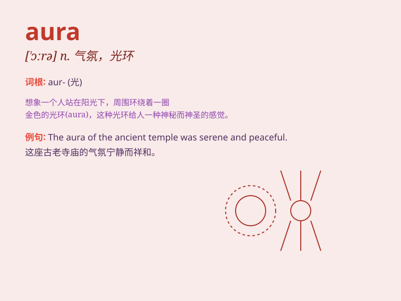

## aura

**英音:** _[\'ɔːrə]_ **美音:** _[\'ɔrə]_

**译义:** *n.气氛,气味,(圣象头部的)光环 [医]先兆,预感*

### 短语

+ **mysterious aura:** _神秘的氛围_

+ **positive aura:** _积极的气场_

+ **aura of confidence:** _自信的气质_

+ **aura of mystery:** _神秘的气息_

+ **peaceful aura:** _平和的氛围_

### 例句

#### 例句1

> **She has an aura of mystery around her.**

**中文翻译:** 她周身有一种神秘的气息。

**单词释义:** 气息；氛围

#### 例句2

> **The old castle has an aura of romance and history.**

**中文翻译:** 这座古老的城堡有一种浪漫和历史的氛围。

**单词释义:** 氛围；气质

#### 例句3

> **His presence creates an aura of calmness.**

**中文翻译:** 他的出现营造出一种平静的氛围。

**单词释义:** 氛围；气场

### 背诵小故事

> Once upon a time, a young artist entered a forest. The moment he
stepped in, he felt a special atmosphere. It was like an \'aura\' of
mystery and peace. This feeling made him create a wonderful painting.

**从前，一位年轻的艺术家走进一片森林。他刚踏入的那一刻，就感受到了一种特殊的氛围。这就像是神秘与平静的"光环"。这种感觉让他创作了一幅精彩的画作。**

### 图义

