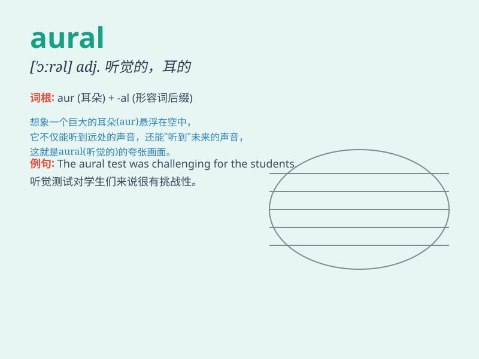

## aural

**英音:** _[\'ɔːr(ə)l]_ **美音:** _[\'ɔrəl]_

**译义:** *adj.听觉的*

### 短语

+ **aural comprehension:** _听力理解_

+ **aural training:** _听力训练_

+ **aural skills:** _听觉技能_

+ **aural perception:** _听觉感知_

+ **aural education:** _听觉教育_

### 例句

#### 例句1

> **The aural training is very important for musicians.**

**中文翻译:** 听觉训练对音乐家来说非常重要。

**单词释义:** 听觉的

#### 例句2

> **She has a good aural memory for sounds.**

**中文翻译:** 她对声音有很好的听觉记忆。

**单词释义:** 听觉的

#### 例句3

> **The aural effect of the concert was amazing.**

**中文翻译:** 这场音乐会的听觉效果令人惊叹。

**单词释义:** 听觉的

### 背诵小故事

> A mouse was in a big cave. It heard strange sounds, but couldn\'t see
anything. The sounds were aural clues. Later, it found the source - a
small waterfall. Aural means related to the sense of hearing.

**一只老鼠在一个大洞穴里。它听到了奇怪的声音，但什么也看不见。这些声音是听觉线索。后来，它找到了源头------一个小瀑布。aural
意思是与听觉有关的。**

### 图义

