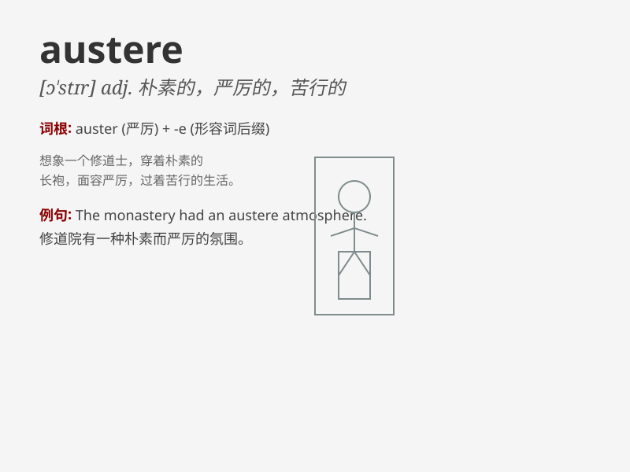

## austere

**英音:** _[ɒ\'stɪə; ɔː-]_ **美音:** _[ɔ\'stɪr]_

**译义:** *adj.严峻的,严厉的,操行上一丝不苟的,简朴的*

### 短语

+ **austere upbringing:** _严格的教养_

+ **austere lifestyle:** _简朴的生活方式_

+ **austere expression:** _严肃的表情_

+ **austere environment:** _艰苦的环境_

+ **austere measures:** _严厉的措施_

### 例句

#### 例句1

> **The monk lived an austere life in the monastery.**

**中文翻译:** 这位僧侣在寺院里过着简朴的生活。

**单词释义:** 简朴的；苦行的

#### 例句2

> **The room had an austere decoration.**

**中文翻译:** 这个房间的装饰很朴素。

**单词释义:** 朴素的

#### 例句3

> **The teacher had an austere expression on her face.**

**中文翻译:** 老师脸上表情严肃。

**单词释义:** 严肃的；严峻的

### 背诵小故事

> A traveler got lost in an austere desert. There was no water or food.
The barren landscape made him feel lonely and desolate. But he remained
strong and finally found his way out. Austere means stern and severe,
lacking comfort or luxury.

**一位旅行者在一片严峻的沙漠中迷路了。那里没有水和食物。荒凉的景象让他感到孤独和凄凉。但他保持坚强，最终找到了出路。austere
意思是严厉的，严峻的，缺乏舒适和奢华。**

### 图义

