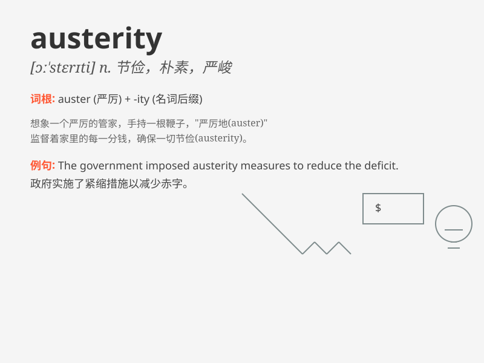

## austerity

**英音:** _[ɒ\'sterɪtɪ; ɔː-]_ **美音:** _[ɔ\'stɛrəti]_

**译义:** *n.严峻,严厉,朴素,节俭,苦行*

### 短语

+ **fiscal austerity:** _财政紧缩_

+ **austerity measures:** _紧缩措施_

+ **austerity drive:** _紧缩运动_

+ **economic austerity:** _经济紧缩_

+ **austerity policy:** _紧缩政策_

### 例句

#### 例句1

> **The government\'s austerity measures have led to cuts in public
services.**

**中文翻译:** 政府的紧缩措施导致了公共服务的削减。

**单词释义:** 紧缩，严格节制

#### 例句2

> **She lived a life of austerity, saving every penny.**

**中文翻译:** 她过着节俭的生活，一分一厘都节省着。

**单词释义:** 节俭，朴素

#### 例句3

> **The austerity of the desert landscape was both beautiful and
forbidding.**

**中文翻译:** 沙漠景观的荒凉既美丽又令人生畏。

**单词释义:** （环境）荒凉，简朴

### 背诵小故事

> In a small village, people faced austerity. There was no extra food
or fun. They had to be very careful with resources. But this made them
strong and learn to value every little thing. Remember, \'austerity\'
means hardship and strict economy.

**在一个小村庄里，人们面临着艰苦朴素的生活。没有多余的食物或娱乐。他们必须非常谨慎地使用资源。但这使他们变得坚强，并学会珍惜每一件小事。记住，'austerity'意思是艰苦朴素和严格的经济状况。**

### 图义

