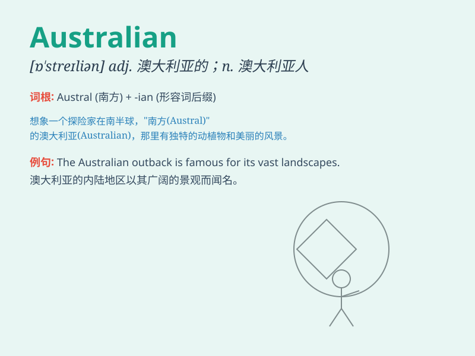

## Australian

**英音:** _[ɒˈstreɪliən]_ **美音:** _[ɔˈstreɪliən]_

**译义:** *adj.澳大利亚的，澳大利亚人的 n.澳大利亚人*

### 短语

+ **Australian dollar:** _澳元_

+ **Australian Open:** _澳大利亚网球公开赛_

+ **Australian Shepherd:** _澳大利亚牧羊犬_

+ **Australian Rules Football:** _澳式橄榄球_

+ **Australian English:** _澳大利亚英语_

### 例句

#### 例句1

> **The Australian government is committed to environmental
protection.**

**中文翻译:** 澳大利亚政府致力于环境保护。

**单词释义:** 澳大利亚的；澳大利亚人的

#### 例句2

> **She has an Australian accent.**

**中文翻译:** 她有澳大利亚口音。

**单词释义:** 澳大利亚的；澳大利亚人的

#### 例句3

> **Australian football is very popular in the country.**

**中文翻译:** 澳式足球在这个国家非常受欢迎。

**单词释义:** 澳大利亚的

### 背诵小故事

> Once upon a time, there was an Australian named Tom. He loved surfing
and always showed the spirit of adventure. His smile and enthusiasm made
him a typical representative of Australians.

**从前，有一个叫汤姆的澳大利亚人。他喜欢冲浪，总是展现出冒险精神。他的笑容和热情使他成为澳大利亚人的典型代表。**

### 图义

