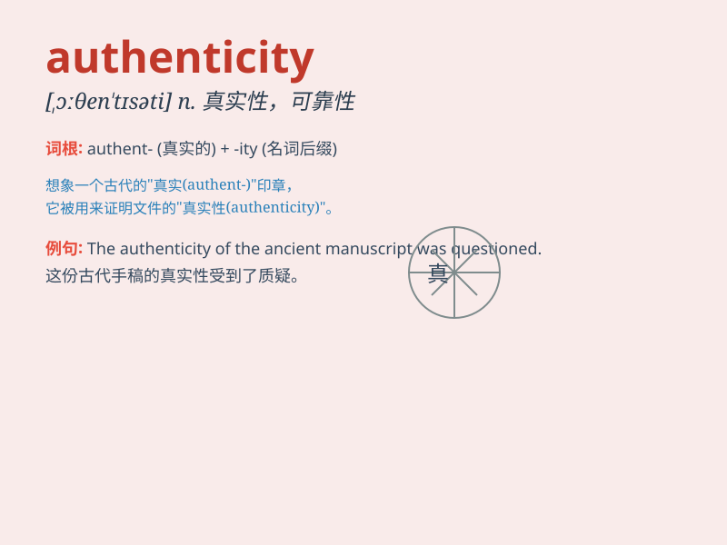

## authenticity

**英音:** _[ɔːθen\'tɪsɪtɪ]_ **美音:** _[,ɔθɛn\'tɪsəti]_

**译义:** *n.确实性,真实性*

### 短语

+ **authenticity certificate:** _真实性证书_

+ **verify authenticity:** _验证真实性_

+ **question authenticity:** _质疑真实性_

+ **assess authenticity:** _评估真实性_

+ **lack authenticity:** _缺乏真实性_

### 例句

#### 例句1

> **The authenticity of the ancient artifact was verified by
experts.**

**中文翻译:** 这件古代文物的真实性由专家进行了验证。

**单词释义:** 真实性

#### 例句2

> **She questioned the authenticity of the document.**

**中文翻译:** 她质疑这份文件的真实性。

**单词释义:** 真实性

#### 例句3

> **The authenticity of his story made it very convincing.**

**中文翻译:** 他故事的真实性使其非常有说服力。

**单词释义:** 真实性

### 背诵小故事

> A detective was verifying the authenticity of a precious painting.
The owner claimed it was genuine, but the detective found some hidden
clues that proved otherwise. Finally, the truth about the painting\'s
authenticity was revealed.

**一位侦探正在核实一幅珍贵画作的真实性。主人声称它是真的，但侦探发现了一些隐藏的线索证明并非如此。最终，这幅画的真实性真相大白。**

### 图义

