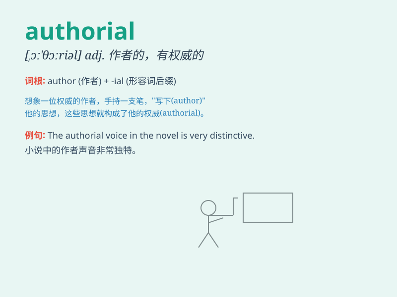

## authorial

**英音:** _[ɔːˈθɔːriəl]_ **美音:** _[ɔːˈθɔːriəl]_

**译义:** *adj.著者的*

### 短语

+ **authorial intention:** _作者意图_

+ **authorial voice:** _作者的声音_

+ **authorial style:** _作者风格_

+ **authorial control:** _作者的掌控_

+ **authorial presence:** _作者的存在_

### 例句

#### 例句1

> **The authorial voice in the novel is distinct and compelling.**

**中文翻译:** 这部小说中的作者风格独特且引人入胜。

**单词释义:** 作者的；著作者的

#### 例句2

> **She displayed strong authorial control over the plot of her
story.**

**中文翻译:** 她对自己故事的情节展现出了强大的作者掌控力。

**单词释义:** 作者的；著作者的

#### 例句3

> **The authorial intent was not immediately obvious to the
readers.**

**中文翻译:** 读者们没有立刻明白作者的意图。

**单词释义:** 作者的；著作者的

### 背诵小故事

> A young writer dreams of having an authorial voice that stands out.
One day, she discovers a magical pen that grants her the unique
authorial style she desires. With it, her works become famous.

**一位年轻的作家梦想拥有独特的作者风格。有一天，她发现了一支神奇的笔，赋予了她渴望的独特的作者风格。凭借此，她的作品出名了。**

### 图义

