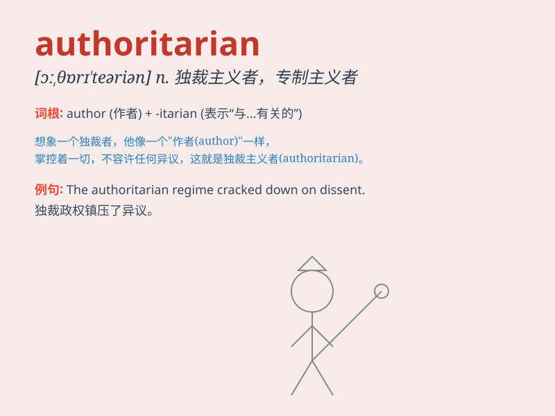

## authoritarian

**英音:** _[ɔː,θɒrɪ\'teərɪən]_ **美音:**
_[ə,θɔrə\'tɛrɪən]_

**译义:** *adj.独裁的,独裁主义的*

### 短语

+ **authoritarian regime:** _独裁政权_

+ **authoritarian personality:** _专制型人格_

+ **authoritarian rule:** _专制统治_

+ **authoritarian leader:** _专制领导人_

+ **authoritarian style:** _专制风格_

### 例句

#### 例句1

> **The authoritarian regime was widely criticized for its human
rights violations.**

**中文翻译:** 这个独裁政权因其侵犯人权的行为而受到广泛批评。

**单词释义:** 独裁主义的；专制的

#### 例句2

> **He has an authoritarian style of management that many employees
dislike.**

**中文翻译:** 他有一种很多员工都不喜欢的专制管理风格。

**单词释义:** 独裁的；专制的

#### 例句3

> **The authoritarian leader refused to listen to any opposing
views.**

**中文翻译:** 这位专制的领导人拒绝听取任何反对意见。

**单词释义:** 独裁的；专制的

### 背诵小故事

>
想象一个国王，他对臣民非常严厉，总是独断专行，要求绝对的服从，不许有任何异议。这个国王就是典型的
authoritarian 式的人物，即专制独裁的。

**想象一个专制独裁的国王来辅助记忆'authoritarian'这个单词，意思是专制独裁的**

### 图义

