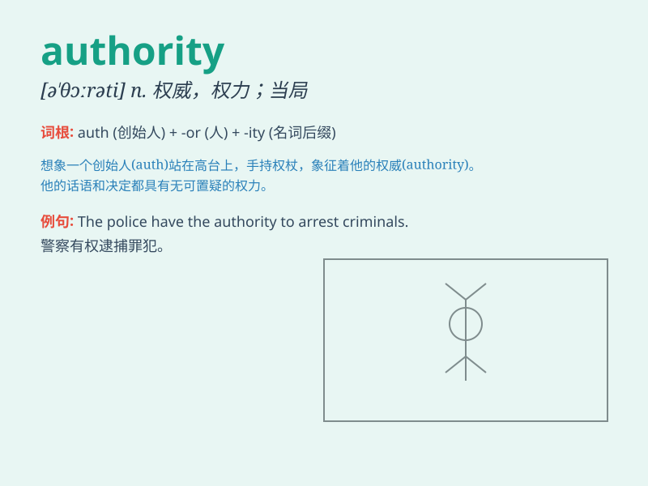

## authority

**英音:** _[ɔː\'θɒrɪtɪ]_ **美音:** _[ə\'θɔrəti]_

**译义:** *n.权威,威信,权威人士,权力,职权,典据,著作权威*

### 短语

+ **competent authority:** _主管当局；主管部门_

+ **local authority:** _地方当局；地方政权_

+ **regulatory authority:** _监管当局；监管机构_

+ **executive authority:** _行政当局；行政权力_

+ **judicial authority:** _司法当局；司法权_

### 例句

#### 例句1

> **The local authority is responsible for maintaining public
order.**

**中文翻译:** 当地政府负责维护公共秩序。

**单词释义:** 政府；当局

#### 例句2

> **She has no authority over me.**

**中文翻译:** 她无权管我。

**单词释义:** 权力；管辖权

#### 例句3

> **He is an authority on ancient history.**

**中文翻译:** 他是古代史方面的权威。

**单词释义:** 权威；专家

### 背诵小故事

> A brave king was the authority of the kingdom. He made fair rules and
everyone respected him. His authority kept the land peaceful and
prosperous.

**一位勇敢的国王是这个王国的权威。他制定公平的规则，每个人都尊敬他。他的权威使这片土地和平繁荣。**

### 图义

