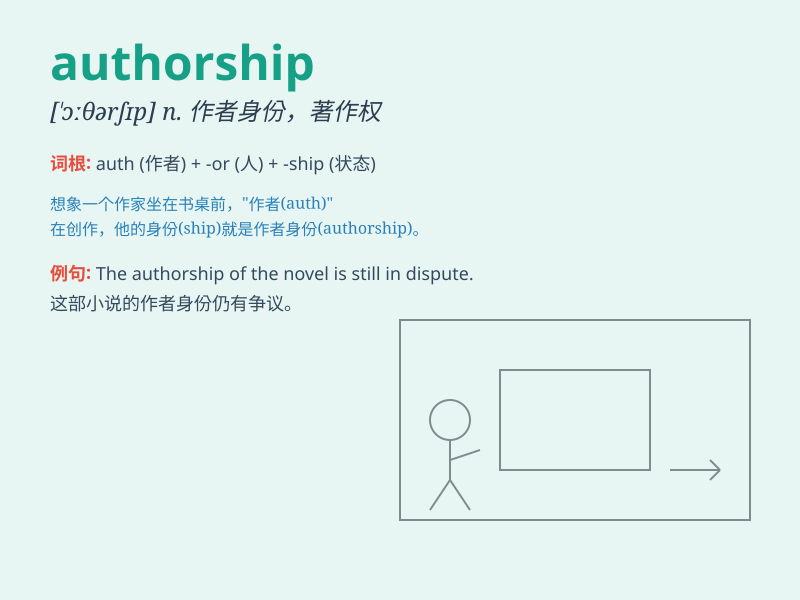

## authorship

**英音:** _[\'ɔːθəʃɪp]_ **美音:** _[\'ɔθɚ\'ʃɪp]_

**译义:** *n.作者的身份,著述业,(思想等的)原创作者,根源*

### 短语

+ **claim authorship:** _声称著作权_

+ **acknowledge authorship:** _承认作者身份_

+ **dispute authorship:** _对作者身份有争议_

+ **establish authorship:** _确立作者身份_

+ **question authorship:** _质疑作者身份_

### 例句

#### 例句1

> **The authorship of this novel is unknown.**

**中文翻译:** 这本小说的作者身份未知。

**单词释义:** 作者身份；著述业

#### 例句2

> **She claimed authorship of the poem.**

**中文翻译:** 她声称是这首诗的作者。

**单词释义:** 作者身份

#### 例句3

> **The book\'s authorship is a matter of debate among scholars.**

**中文翻译:** 这本书的作者是谁在学者中是一个有争议的问题。

**单词释义:** 作者身份

### 背诵小故事

> A famous writer was always proud of his authorship. One day, a young
fan asked him about it. The writer explained that authorship means the
act of creating a book or a piece of writing and taking responsibility
for it. The fan understood easily.

**一位著名的作家总是为自己的著作权感到骄傲。有一天，一位年轻的粉丝问他。作家解释说，著作权指创作一本书或一篇作品并对其负责的行为。粉丝很容易就理解了。**

### 图义

