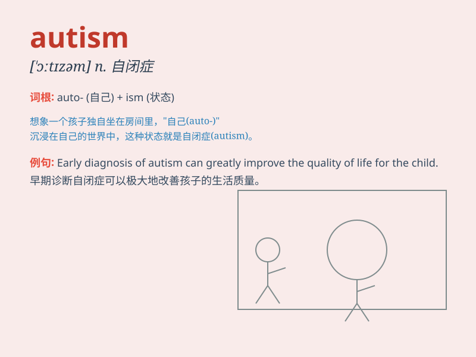

## autism

**英音:** _[\'ɔːtɪz(ə)m]_ **美音:** _[\'ɔtɪzəm]_

**译义:** *n.[心]自我中心主义,孤独症*

### 短语

+ **childhood autism:** _儿童自闭症_

+ **autism spectrum disorder:** _自闭症谱系障碍_

+ **high-functioning autism:** _高功能自闭症_

+ **low-functioning autism:** _低功能自闭症_

+ **diagnosis of autism:** _自闭症的诊断_

### 例句

#### 例句1

> **The child was diagnosed with autism at an early age.**

**中文翻译:** 这个孩子在很小的时候就被诊断出患有自闭症。

**单词释义:** 自闭症

#### 例句2

> **Autism spectrum disorder affects social interaction and
communication.**

**中文翻译:** 自闭症谱系障碍会影响社交互动和交流。

**单词释义:** 自闭症

#### 例句3

> **Research on autism is constantly evolving to improve treatment
options.**

**中文翻译:** 关于自闭症的研究在不断发展，以改善治疗方案。

**单词释义:** 自闭症

### 背诵小故事

> A little boy named Tom always lived in his own world, not interacting
much with others. One day, a doctor said Tom had autism. It means he has
difficulty communicating and relating to the outside world.

**一个叫汤姆的小男孩总是活在自己的世界里，不太和别人交流。有一天，医生说汤姆有自闭症。这意味着他在与外界交流和联系方面有困难。**

### 图义

