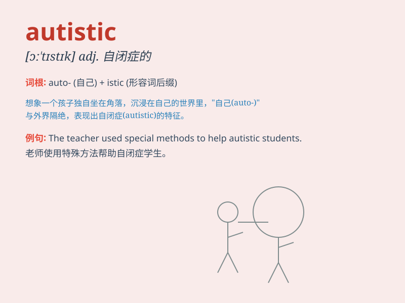

## autistic

**英音:** _[ɔː\'tɪstɪk]_ **美音:** _[ɔ\'tɪstɪk]_

**译义:** *n.(专注自我而与现实隔绝的)孤独症患者(常指儿童)*

### 短语

+ **autistic disorder:** _自闭症障碍_

+ **autistic spectrum:** _自闭症谱系_

+ **high-functioning autistic:** _高功能自闭症患者_

+ **autistic child:** _自闭症儿童_

+ **autistic behavior:** _自闭症行为_

### 例句

#### 例句1

> **The autistic child has difficulty communicating with others.**

**中文翻译:** 这个患有自闭症的孩子在与他人交流方面有困难。

**单词释义:** 患有自闭症的

#### 例句2

> **She is working with autistic patients to improve their lives.**

**中文翻译:** 她正在与自闭症患者一起工作，以改善他们的生活。

**单词释义:** 自闭症的

#### 例句3

> **The research focuses on the behaviors of autistic
individuals.**

**中文翻译:** 这项研究聚焦于自闭症个体的行为。

**单词释义:** 自闭症的

### 背诵小故事

> A little boy named Tom was always alone and had difficulty
communicating. One day, a doctor said, \'Tom is autistic.\' It means he
has challenges in social interaction and communication. But with love
and care, he can improve.

**一个叫汤姆的小男孩总是独自一人，交流有困难。有一天，一位医生说：'汤姆有自闭症。'这意味着他在社交互动和交流方面存在挑战。但有了爱和关怀，他能够改善。**

### 图义

