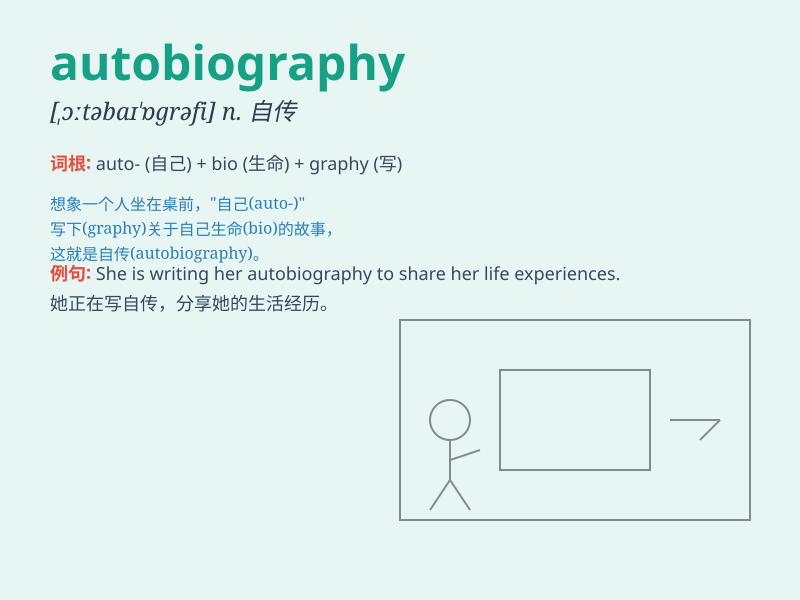

## autobiography

**英音:** _[ɔːtəbaɪ\'ɒgrəfɪ]_ **美音:**
_[,ɔtəbaɪ\'ɑɡrəfi]_

**译义:** *n.自传*

### 短语

+ **write an autobiography:** _写自传_

+ **read an autobiography:** _读自传_

+ **publish an autobiography:** _出版自传_

+ **autobiography of a celebrity:** _一位名人的自传_

+ **memorable autobiography:** _令人难忘的自传_

### 例句

#### 例句1

> **I\'m reading an autobiography of a famous actor.**

**中文翻译:** 我正在读一本著名演员的自传。

**单词释义:** 自传

#### 例句2

> **Her autobiography reveals many secrets of her life.**

**中文翻译:** 她的自传揭示了她生活中的许多秘密。

**单词释义:** 自传

#### 例句3

> **The autobiography is a bestseller.**

**中文翻译:** 这本自传是一本畅销书。

**单词释义:** 自传

### 背诵小故事

> A famous author was asked to write an autobiography. He sat down and
started recalling his life journey. From his childhood dreams to his
greatest achievements, he poured it all into the autobiography.
Autobiography means a person\'s account of their own life.

**一位著名的作家被要求写自传。他坐下来开始回忆自己的人生旅程。从童年梦想至最大的成就，他将一切都倾注进了自传。autobiography
意思是自传。**

### 图义

