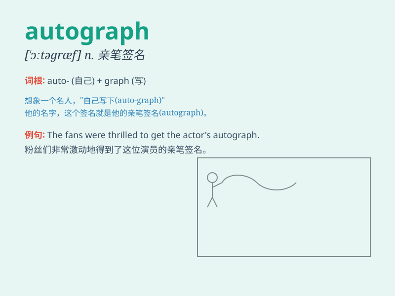

## autograph

**英音:** _[\'ɔːtəgrɑːf]_ **美音:** _[\'ɔtəɡræf]_

**译义:** *n.亲笔签名,手稿adj.署名v.署名*

### 短语

+ **sign an autograph:** _签名_

+ **collect autographs:** _收集签名_

+ **give an autograph:** _给一个签名_

+ **autograph session:** _签名会_

+ **autograph book:** _签名簿_

### 例句

#### 例句1

> **I got the actor\'s autograph after the show.**

**中文翻译:** 演出结束后我得到了这位演员的亲笔签名。

**单词释义:** 亲笔签名

#### 例句2

> **The famous singer refused to autograph for the fans.**

**中文翻译:** 这位著名歌手拒绝为粉丝签名。

**单词释义:** 签名

#### 例句3

> **He treasures the autograph of his favorite athlete.**

**中文翻译:** 他珍视他最喜欢的运动员的签名。

**单词释义:** 签名

### 背诵小故事

> A famous singer was at a party. Many fans wanted something special.
So, the singer used a pen to write his name on their notebooks. That was
an autograph, a special signature given by a famous person.

**一位著名歌手在一个聚会上。许多粉丝想要一些特别的东西。于是，歌手用笔在他们的笔记本上写下自己的名字。那就是签名，名人给出的特殊署名。**

### 图义

