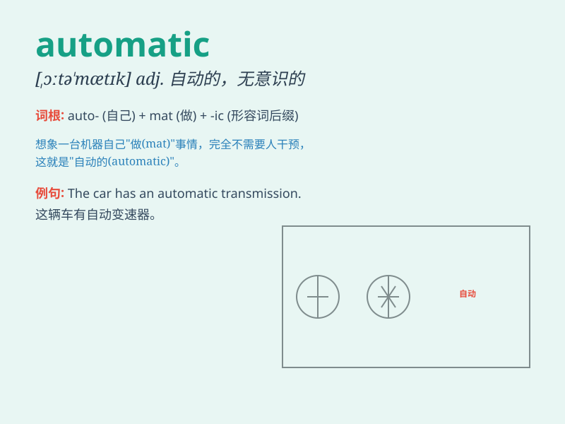

## automatic

**英音:** _[ɔːtə\'mætɪk]_ **美音:** _[\'ɔtə\'mætɪk]_

**译义:** *n.自动机械adj.自动的,无意识的,机械的*

### 短语

+ **automatic transmission:** _自动变速器_

+ **automatic pilot:** _自动驾驶仪_

+ **automatic weapon:** _自动武器_

+ **automatic response:** _自动反应_

+ **automatic door:** _自动门_

### 例句

#### 例句1

> **The new car has an automatic transmission.**

**中文翻译:** 这辆新车有自动变速器。

**单词释义:** 自动的

#### 例句2

> **She set the coffee machine to automatic so it would start brewing
at a certain time.**

**中文翻译:**
她把咖啡机设置为自动模式，这样它会在特定时间开始煮咖啡。

**单词释义:** 自动的

#### 例句3

> **His response was almost automatic; he didn\'t even have to think
about it.**

**中文翻译:** 他的反应几乎是下意识的；他甚至都不用思考。

**单词释义:** 下意识的；不自觉的

### 背诵小故事

> One day, a factory owner was very happy because he bought an
automatic machine. It worked all by itself without the need for constant
human control. The machine made the production process smooth and
efficient.

**有一天，一位工厂老板非常高兴，因为他买了一台自动机器。它自己工作，不需要人类持续控制。这台机器让生产过程变得顺利且高效。**

### 图义

