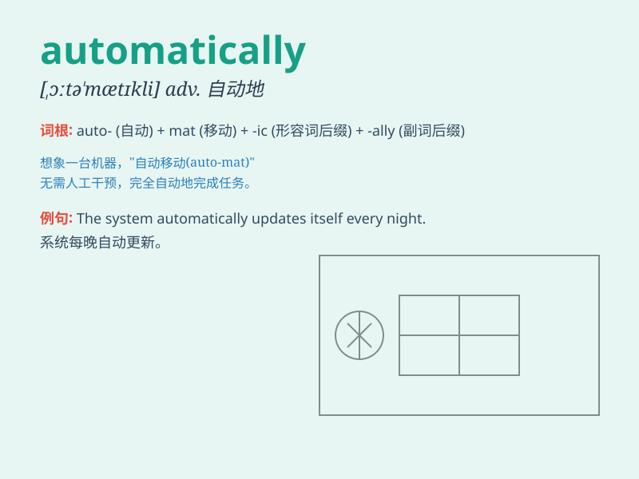

## automatically

**英音:** _[ˌɔːtəˈmætɪkli]_ **美音:** _[ˌɔtəˈmætɪkli]_

**译义:** *adv.自动地,机械地*

### 短语

+ **automatically controlled:** _自动控制的_

+ **automatically update:** _自动更新_

+ **automatically generated:** _自动生成的_

+ **automatically adjust:** _自动调节_

+ **automatically start:** _自动启动_

### 例句

#### 例句1

> **The machine automatically stops when it detects a fault.**

**中文翻译:** 当机器检测到故障时会自动停止。

**单词释义:** 自动地

#### 例句2

> **The door automatically locks when you close it.**

**中文翻译:** 你关门时，门会自动锁上。

**单词释义:** 自动地

#### 例句3

> **The system automatically saves your work at regular
intervals.**

**中文翻译:** 系统会定期自动保存你的工作。

**单词释义:** 自动地

### 背诵小故事

> A robot in a factory works automatically. It doesn\'t need human
control. It just follows the pre-set programs and does the job
perfectly. So, automatically means doing something by itself without
human intervention.

**一家工厂里的一个机器人自动工作。它不需要人工控制。它只是遵循预先设定的程序，完美地完成工作。所以，automatically
意思是自动地、无意识地做某事，无需人为干预。**

### 图义

