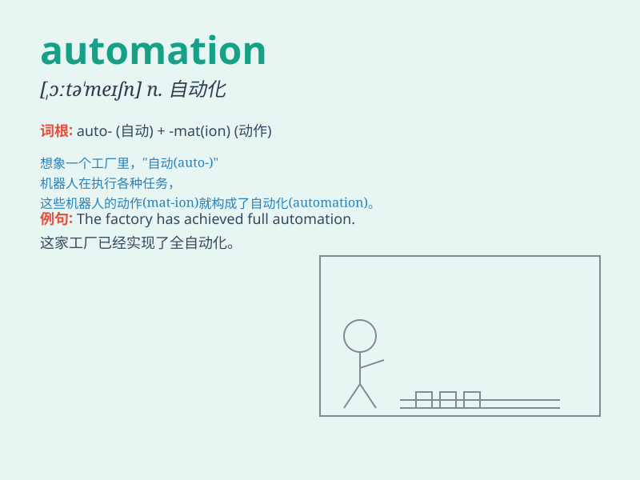

## automation

**英音:** _[ɔːtə\'meɪʃ(ə)n]_ **美音:** _[,ɔtə\'meʃən]_

**译义:** *n.自动控制,自动操作*

### 短语

+ **industrial automation:** _工业自动化_

+ **office automation:** _办公自动化_

+ **automation system:** _自动化系统_

+ **production automation:** _生产自动化_

+ **home automation:** _家庭自动化_

### 例句

#### 例句1

> **The factory has achieved a high level of automation, reducing the
need for manual labor.**

**中文翻译:**
这家工厂已经实现了高度的自动化，减少了对人工劳动力的需求。

**单词释义:** 自动化

#### 例句2

> **Automation in the office can improve efficiency and accuracy.**

**中文翻译:** 办公室的自动化可以提高效率和准确性。

**单词释义:** 自动化

#### 例句3

> **The development of automation has brought about significant
changes in the manufacturing industry.**

**中文翻译:** 自动化的发展给制造业带来了重大的变化。

**单词释义:** 自动化

### 背诵小故事

> A factory owner was always tired of manual work. So he decided to
bring in machines for AUTOMATION. With this change, the production
became efficient and workers had an easier time.

**一位工厂老板总是对人工工作感到厌倦。所以他决定引入机器实现自动化。有了这个改变，生产变得高效，工人们也轻松了许多。**

### 图义

