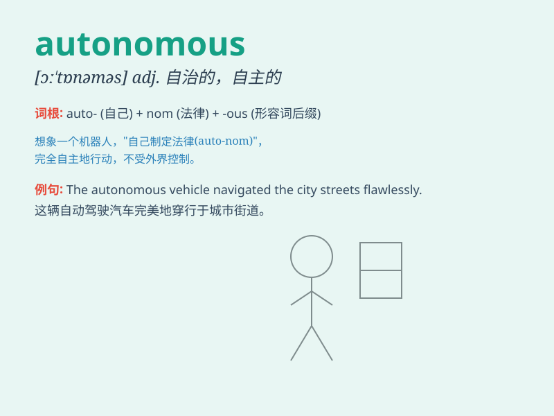

## autonomous

**英音:** _[ɔː\'tɒnəməs]_ **美音:** _[ɔ\'tɑnəməs]_

**译义:** *adj.自治的*

### 短语

+ **autonomous region:** _自治区_

+ **autonomous system:** _自治系统_

+ **autonomous vehicle:** _自动驾驶汽车_

+ **autonomous learning:** _自主学习_

+ **autonomous expenditure:** _自发支出_

### 例句

#### 例句1

> **The car has an autonomous driving mode.**

**中文翻译:** 这辆车有自动驾驶模式。

**单词释义:** 自主的；自治的

#### 例句2

> **Some regions enjoy autonomous status within the country.**

**中文翻译:** 一些地区在国内享有自治地位。

**单词释义:** 自治的

#### 例句3

> **The university is an autonomous institution.**

**中文翻译:** 这所大学是一个自主的机构。

**单词释义:** 自主的

### 背诵小故事

> In a distant future, robots have become autonomous. They can make
decisions and act independently without human control. This ability to
be self-governing is what \'autonomous\' means.

**在遥远的未来，机器人变得自主了。它们可以自主地做决定和行动，无需人类控制。这种自我管理的能力就是'autonomous'的意思。**

### 图义

