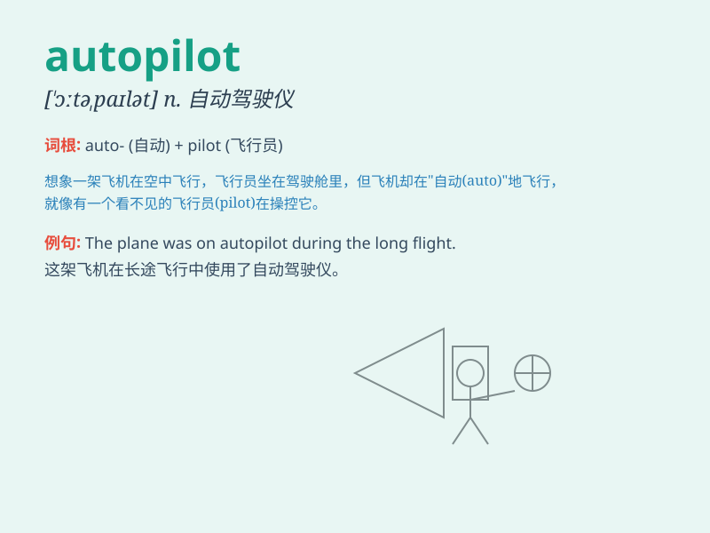

## autopilot

**英音:** _[ˈɔːtəʊpaɪlət]_ **美音:** _[ˈɔːtoʊpaɪlət]_

**译义:** *n.自动驾驶仪*

### 短语

+ **on autopilot:** _处于自动驾驶状态；习惯性地做；机械地做_

+ **put sth on autopilot:**
_使某物处于自动驾驶状态；使某事自动进行_

+ **fly on autopilot:** _自动驾驶飞行_

+ **operate on autopilot:** _自动操作；自动驾驶_

+ **driving on autopilot:** _自动驾驶_

### 例句

#### 例句1

> **The plane was on autopilot for most of the flight.**

**中文翻译:** 这架飞机在大部分飞行时间里处于自动驾驶状态。

**单词释义:** 自动驾驶

#### 例句2

> **He seems to be on autopilot at work, just going through the
motions.**

**中文翻译:** 他工作时似乎处于自动模式，只是在敷衍了事。

**单词释义:** 自动模式；机械行事

#### 例句3

> **After a long day, my mind went on autopilot and I forgot about
the important meeting.**

**中文翻译:**
漫长的一天过后，我的大脑进入了自动状态，忘记了那场重要的会议。

**单词释义:** 自动状态

### 背诵小故事

> One day, I was on a long flight. The plane was on autopilot, which
meant it could fly by itself without the pilot constantly controlling.
It was like a magic system that made the journey smooth and safe.

**有一天，我在一次长途飞行中。飞机处于自动驾驶状态，这意味着它可以自行飞行，无需飞行员持续控制。这就像一个神奇的系统，让旅程平稳又安全。**

### 图义

