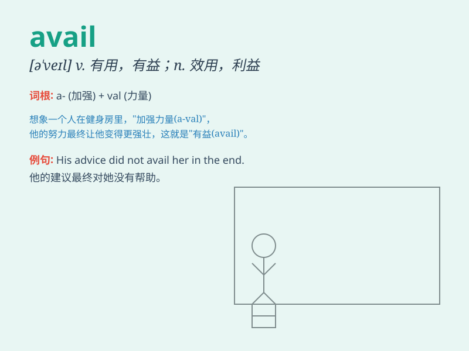

## avail

**英音:** _[ə\'veɪl]_ **美音:** _[ə\'vel]_

**译义:** *vi.有益于,有帮助,有用,有利vt.有利于n.效用,利益*

### 短语

+ **of no avail:** _无效；不起作用_

+ **avail oneself of:** _利用_

+ **to little avail:** _没什么用处；几乎徒劳_

+ **without avail:** _徒劳；无效_

+ **avail much:** _很有帮助；很有用_

### 例句

#### 例句1

> **His efforts to persuade her were of no avail.**

**中文翻译:** 他试图说服她，但毫无用处。

**单词释义:** 用处；效用

#### 例句2

> **I avail myself of this opportunity to express my gratitude to
you.**

**中文翻译:** 我借此机会向您表达我的感激之情。

**单词释义:** 利用

#### 例句3

> **Nothing availed against the flood.**

**中文翻译:** 什么都挡不住洪水。

**单词释义:** 有帮助；有益

### 背诵小故事

> A poor man was in great need. He sought help everywhere but to no
avail. Finally, a kind-hearted lady came and her assistance was of great
avail to him.

**一个穷人非常需要帮助。他到处寻求帮助但都无济于事。最后，一位善良的女士来了，她的帮助对他非常有用。**

### 图义

