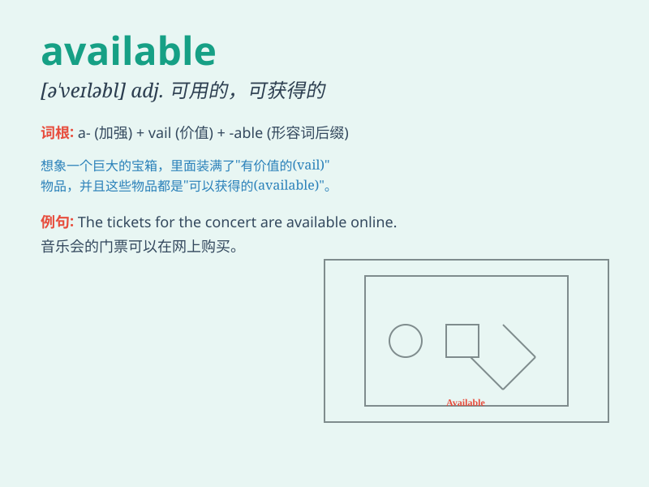

## available

**英音:** _[ə\'veɪləb(ə)l]_ **美音:** _[ə\'veləbl]_

**译义:** *adj.可用到的,可利用的,有用的,有空的,接受探访的*

### 短语

+ **available resources:** _可用资源_

+ **available information:** _可获取的信息_

+ **available options:** _可行的选择_

+ **available funds:** _可用资金_

+ **available space:** _可用空间_

### 例句

#### 例句1

> **There are no tickets available for the concert.**

**中文翻译:** 这场音乐会没有票了。

**单词释义:** 可得到的；可获得的

#### 例句2

> **The doctor is not available now. You have to wait for a
while.**

**中文翻译:** 医生现在没空。你得等一会儿。

**单词释义:** 有空的；可会见的

#### 例句3

> **This information is available to anyone interested.**

**中文翻译:** 任何感兴趣的人都可以获得这个信息。

**单词释义:** 可利用的；可得到的

### 背诵小故事

> One day, I was in a hurry to find a pen. I searched everywhere and
finally found one in the drawer. It was available just when I needed it
most. This pen saved my day!

**一天，我急着找一支笔。我到处找，最后在抽屉里找到了一支。就在我最需要的时候它是可用的。这支笔救了我！**

### 图义

