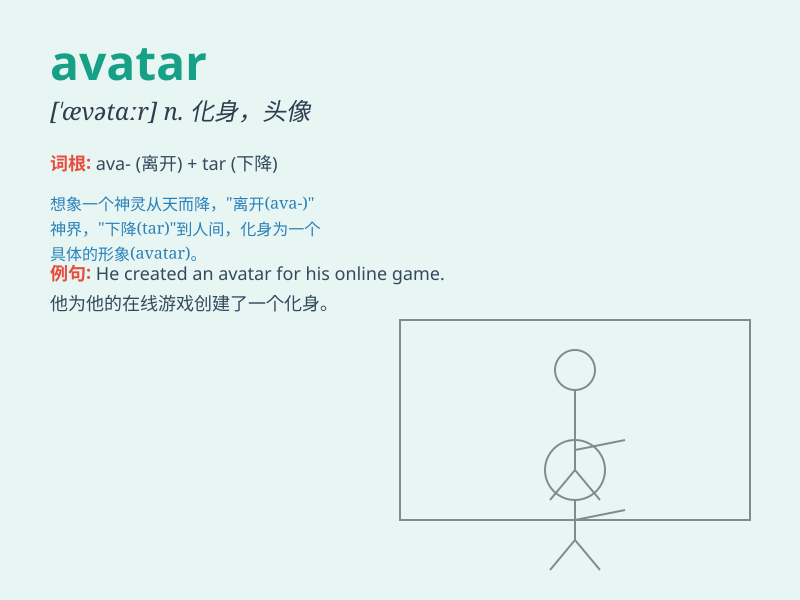

## avatar

**英音:** _[\'ævətɑː]_ **美音:** _[\'ævətɑr]_

**译义:** *n.化身,天神下凡,具体化*

### 短语

+ **avatar image:** _头像图片_

+ **digital avatar:** _数字化身_

+ **avatar creation:** _化身创建_

+ **avatar system:** _化身系统_

+ **custom avatar:** _自定义头像_

### 例句

#### 例句1

> **In the virtual world, users can customize their avatars to look
unique.**

**中文翻译:**
在虚拟世界中，用户可以自定义自己的头像，使其看起来独一无二。

**单词释义:** 虚拟形象

#### 例句2

> **The game offers a wide range of avatars for players to choose
from.**

**中文翻译:** 游戏提供了多种角色供玩家选择。

**单词释义:** 虚拟形象

#### 例句3

> **She changed her avatar frequently to show her different
moods.**

**中文翻译:** 她经常更换头像来展现自己不同的心情。

**单词释义:** 虚拟形象

### 背诵小故事

> In a magical world, a brave warrior had the power to transform into
an avatar. This avatar was a powerful being with unique abilities that
helped the warrior save the kingdom. Remember, \'avatar\' is like this
magical form.

**在一个神奇的世界里，一位勇敢的战士拥有变成阿凡达的能力。这个阿凡达是具有独特能力的强大存在，帮助战士拯救了王国。记住，\'avatar\'就像这种神奇的形态。**

### 图义

