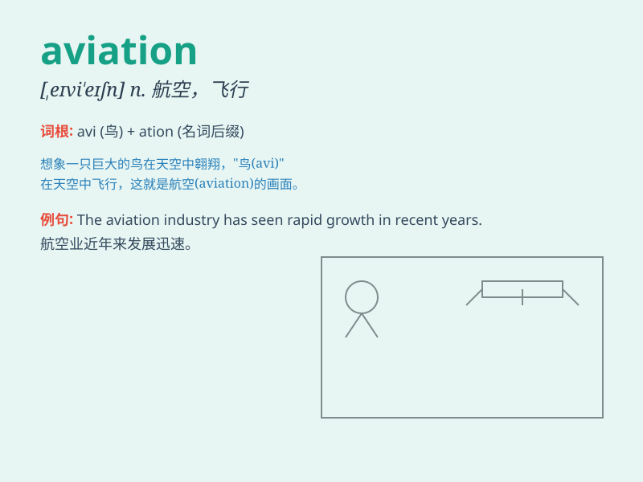

## aviation

**英音:** _[eɪvɪ\'eɪʃ(ə)n]_ **美音:** _[,evɪ\'eʃən]_

**译义:** *n.飞行,航空,航空学,航空术*

### 短语

+ **aviation industry:** _航空业_

+ **aviation safety:** _航空安全_

+ **aviation fuel:** _航空燃料_

+ **aviation accident:** _航空事故_

+ **aviation authority:** _航空当局_

### 例句

#### 例句1

> **The aviation industry has seen significant growth in recent
years.**

**中文翻译:** 近年来，航空业取得了显着增长。

**单词释义:** 航空

#### 例句2

> **He is studying aviation engineering at the university.**

**中文翻译:** 他正在大学学习航空工程。

**单词释义:** 航空

#### 例句3

> **Aviation safety is of utmost importance.**

**中文翻译:** 航空安全至关重要。

**单词释义:** 航空

### 背诵小故事

> A brave pilot was passionate about aviation. He flew through storms
and over mountains, always chasing his dream in the sky. Aviation was
not just a word for him but a thrilling adventure.

**一位勇敢的飞行员对航空充满热情。他穿越风暴、飞越山脉，一直在天空中追逐自己的梦想。对他来说，航空不仅仅是一个词，而是一场惊心动魄的冒险。**

### 图义

