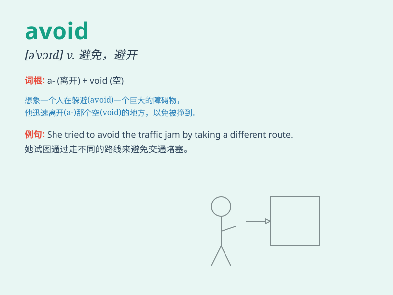

## avoid

**英音:** _[ə\'vɒɪd]_ **美音:** _[ə\'vɔɪd]_

**译义:** *vt.避免,消除*

### 短语

+ **avoid doing sth:** _避免做某事_

+ **avoid sb/sth like the plague:** _像躲避瘟疫一样避开某人/某物_

+ **avoidable risk:** _可避免的风险_

+ **unavoidable consequence:** _不可避免的后果_

+ **avoidance behavior:** _回避行为_

### 例句

#### 例句1

> **I avoided answering his question.**

**中文翻译:** 我回避回答他的问题。

**单词释义:** 避免

#### 例句2

> **She avoids going out alone at night.**

**中文翻译:** 她避免晚上独自外出。

**单词释义:** 避免

#### 例句3

> **To avoid traffic jams, he leaves home early.**

**中文翻译:** 为了避免交通堵塞，他提前离开家。

**单词释义:** 避免

### 背诵小故事

> One day, Tom was walking on the street. There was a big dog barking
fiercely in front of him. Tom quickly turned around and took another way
to avoid the dangerous dog.

**一天，汤姆正在街上走。有一只大狗在他面前凶猛地叫。汤姆迅速转身，走另一条路以避开这只危险的狗。**

### 图义

