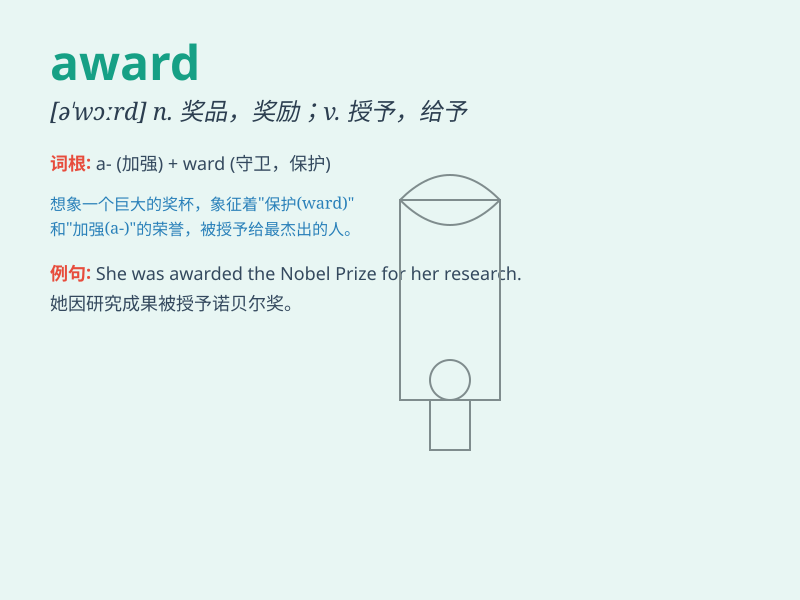

## award

**英音:** _[ə\'wɔːd]_ **美音:** _[ə\'wɔrd]_

**译义:** *n.奖,奖品vt.授予,判给*

### 短语

+ **award ceremony:** _颁奖典礼_

+ **award winning:** _获奖的_

+ **academic award:** _学术奖_

+ **employee of the month award:** _月度最佳员工奖_

+ **best actress award:** _最佳女演员奖_

### 例句

#### 例句1

> **She was awarded the Nobel Prize for Literature.**

**中文翻译:** 她被授予诺贝尔文学奖。

**单词释义:** 授予；给予

#### 例句2

> **The judge awarded damages to the plaintiff.**

**中文翻译:** 法官判给原告赔偿损失。

**单词释义:** 判给；判定

#### 例句3

> **He was awarded a medal for his bravery.**

**中文翻译:** 他因勇敢而被授予勋章。

**单词释义:** 授予；颁发

### 背诵小故事

> A brave firefighter saved many lives in a big fire. The mayor awarded
him a shiny medal for his courage. The award made him very happy and
proud.

**一位勇敢的消防员在一场大火中拯救了许多生命。市长授予他一枚闪亮的奖章以表彰他的勇气。这个奖项让他非常高兴和自豪。**

### 图义

