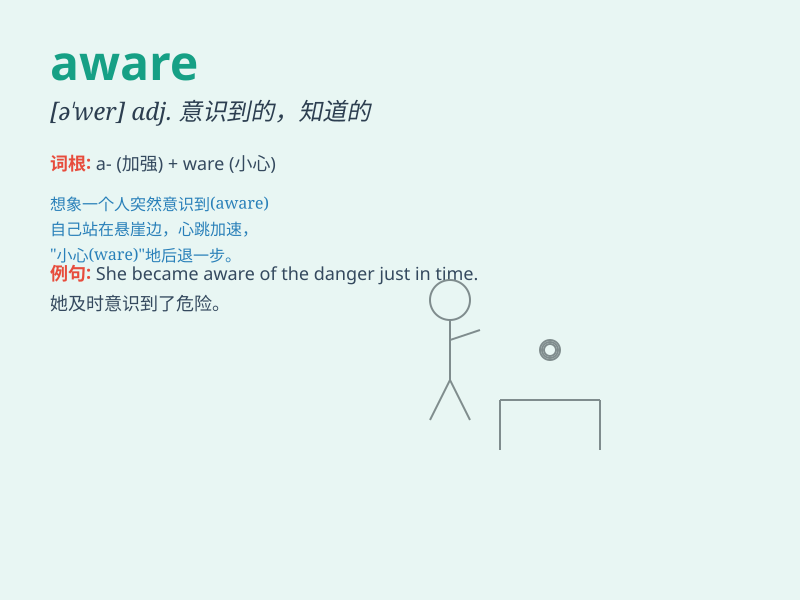

## aware

**英音:** _[ə\'weə]_ **美音:** _[ə\'wɛr]_

**译义:** *adj.知道的,明白的,意识到的*

### 短语

+ **be aware of:** _知道；意识到_

+ **become aware of:** _开始意识到_

+ **make someone aware of:** _使某人意识到_

+ **aware consciousness:** _自觉意识_

+ **socially aware:** _有社会意识的_

### 例句

#### 例句1

> **I was not aware of the danger.**

**中文翻译:** 我没有意识到危险。

**单词释义:** 意识到

#### 例句2

> **She became aware that something was wrong.**

**中文翻译:** 她意识到有些不对劲。

**单词释义:** 意识到

#### 例句3

> **He is well aware of his responsibilities.**

**中文翻译:** 他非常清楚自己的责任。

**单词释义:** 清楚

### 背诵小故事

> One day, while walking in the forest, Tom suddenly saw a dangerous
snake. Luckily, he was aware of the potential danger and moved away
quickly. He knew he had to be cautious.

**一天，汤姆在森林里散步，突然看到一条危险的蛇。幸运的是，他意识到了潜在的危险并迅速躲开。他知道自己必须小心。**

### 图义

