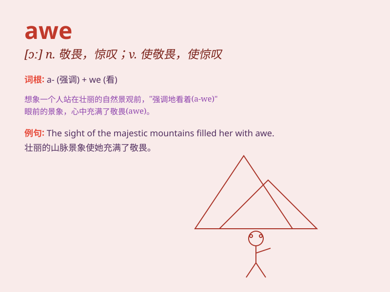

## awe

**英音:** _[ɔː]_ **美音:** _[ɔ]_

**译义:** *n.敬畏vt.敬畏*

### 短语

+ **stand in awe:** _肃然起敬；敬畏_

+ **be filled with awe:** _充满敬畏_

+ **in awe of:** _对\...敬畏；对\...望而生畏_

+ **awestruck:** _惊奇不已的；敬畏的_

+ **awe-inspiring:** _令人起敬畏心的；令人惊叹的_

### 例句

#### 例句1

> **The grandeur of the mountains filled her with awe.**

**中文翻译:** 山的雄伟让她心生敬畏。

**单词释义:** 敬畏

#### 例句2

> **He stood in awe of his father\'s achievements.**

**中文翻译:** 他对父亲的成就感到敬畏。

**单词释义:** 敬畏

#### 例句3

> **The audience watched the performance in awe.**

**中文翻译:** 观众们惊叹不已地观看了表演。

**单词释义:** 敬畏

### 背诵小故事

> A young artist stood in front of a magnificent mountain, filled with
awe. The size and beauty of the mountain made him speechless. This
feeling of being deeply impressed and respectful was exactly what
\'awe\' means.

**一位年轻的艺术家站在一座雄伟的山前，满心敬畏。山的规模和美丽让他说不出话来。这种深深被打动和充满敬意的感觉正是'awe'这个词的含义。**

### 图义

