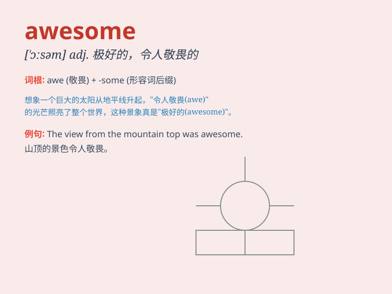

## awesome

**英音:** _[\'ɔːs(ə)m]_ **美音:** _[\'ɔsəm]_

**译义:** *adj.引起敬畏的,可怕的*

### 短语

+ **awesome responsibility:** _重大的责任_

+ **awesome power:** _强大的力量_

+ **awesome beauty:** _令人惊叹的美丽_

+ **awesome achievement:** _了不起的成就_

+ **awesome experience:** _极好的经历_

### 例句

#### 例句1

> **The view from the mountain top was awesome.**

**中文翻译:** 山顶的景色非常棒。

**单词释义:** 令人惊叹的；极好的

#### 例句2

> **You did an awesome job on the project.**

**中文翻译:** 你在这个项目上做得非常出色。

**单词释义:** 出色的；了不起的

#### 例句3

> **The new movie is simply awesome.**

**中文翻译:** 这部新电影简直太棒了。

**单词释义:** 极好的；令人敬畏的

### 背诵小故事

> One day, I was lost in a forest. Suddenly, I saw an awesome
waterfall. Its beauty and power were astonishing. It made me feel small
but also filled me with wonder. From then on, I\'ll never forget the
meaning of \'awesome\'.

**有一天，我在森林里迷路了。突然，我看到了一个令人惊叹的瀑布。它的美丽和力量令人震惊。它让我感到自己的渺小，但也让我充满了惊奇。从那以后，我永远不会忘记\'awesome\'这个词的意思。**

### 图义

