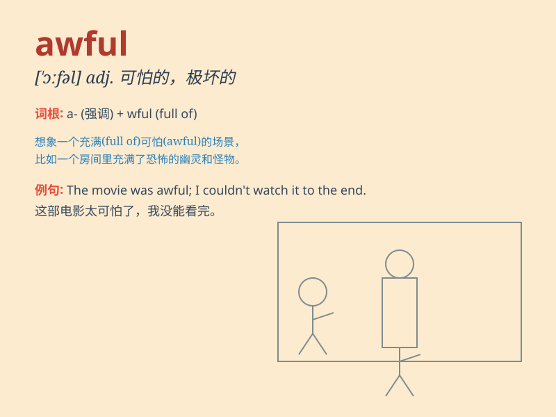

## awful

**英音:** _[\'ɔːfʊl]_ **美音:** _[\'ɔfl]_

**译义:** *adj.可怕的,威严的,\<口>极度的,糟糕的*

### 短语

+ **an awful lot:** _大量；许多_

+ **awful weather:** _恶劣的天气_

+ **awful mess:** _一团糟；凌乱不堪_

+ **awful pain:** _剧痛_

+ **awful experience:** _糟糕的经历_

### 例句

#### 例句1

> **The weather is awful today.**

**中文翻译:** 今天的天气很糟糕。

**单词释义:** 极坏的；糟糕的

#### 例句2

> **I had an awful headache last night.**

**中文翻译:** 昨晚我头疼得很厉害。

**单词释义:** 严重的；剧烈的

#### 例句3

> **The food at that restaurant was awful.**

**中文翻译:** 那家餐厅的食物很糟糕。

**单词释义:** 极坏的；极差的

### 背诵小故事

> One day, I went to a haunted house. The experience inside was awful.
There were strange noises and creepy shadows everywhere. I felt very
scared and wanted to leave quickly.

**有一天，我去了一个鬼屋。里面的经历糟透了。到处都是奇怪的声音和令人毛骨悚然的阴影。我感到非常害怕，想赶快离开。**

### 图义

