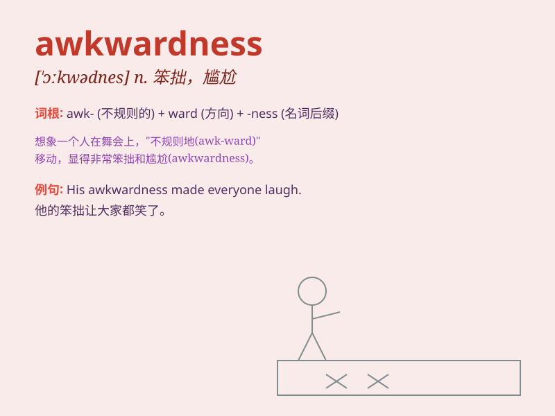

## awkwardness

**英音:** _[\'ɔːkwədnəs]_ **美音:** _[\'ɔːkwədnəs]_

**译义:** *n.笨拙,不雅观*

### 短语

+ **social awkwardness:** _社交尴尬_

+ **awkwardness in communication:** _交流中的笨拙_

+ **emotional awkwardness:** _情感上的别扭_

+ **awkwardness of movement:** _动作的笨拙_

+ **awkwardness in behavior:** _行为上的尴尬_

### 例句

#### 例句1

> **His awkwardness at the party made him stand out in an
uncomfortable way.**

**中文翻译:** 他在聚会上的尴尬让他以一种不舒服的方式脱颖而出。

**单词释义:** 笨拙；尴尬

#### 例句2

> **The awkwardness of the situation was palpable.**

**中文翻译:** 场面之尴尬可想而知。

**单词释义:** 尴尬；难为情

#### 例句3

> **She tried to hide her awkwardness when meeting her
ex-boyfriend.**

**中文翻译:** 见到前男友时，她试图掩饰自己的尴尬。

**单词释义:** 尴尬；不自在

### 背诵小故事

> Once there was a clumsy boy who always felt awkwardness in social
situations. He tripped when dancing and spilled drinks at parties. This
constant feeling of being uncomfortable was what we call
\'awkwardness\'.

**曾经有一个笨拙的男孩，在社交场合总是感到尴尬。他跳舞时绊倒，聚会时洒了饮料。这种持续的不舒服的感觉就是我们所说的'尴尬；笨拙'。**

### 图义

