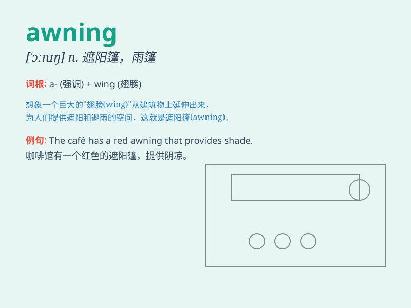

## awning

**英音:** _[\'ɔːnɪŋ]_ **美音:** _[\'ɔnɪŋ]_

**译义:** *n.遮阳篷,雨篷*

### 短语

+ **awning window:** _遮阳篷窗；上悬窗_

+ **patio awning:** _露台遮阳篷_

+ **boat awning:** _船篷_

+ **retractable awning:** _可伸缩遮阳篷_

+ **awning fabric:** _遮阳篷织物_

### 例句

#### 例句1

> **The awning provided shade on the hot summer day.**

**中文翻译:** 遮阳篷在炎热的夏日提供了阴凉。

**单词释义:** 遮阳篷

#### 例句2

> **We sat under the awning and enjoyed the view of the beach.**

**中文翻译:** 我们坐在遮阳篷下欣赏海滩的景色。

**单词释义:** 遮阳篷

#### 例句3

> **The store\'s awning was damaged in the storm.**

**中文翻译:** 商店的遮阳篷在暴风雨中受损。

**单词释义:** 遮阳篷

### 背诵小故事

> One sunny day, I was walking on the street. Suddenly, it started
raining. Luckily, there was an awning in front of a store. I stood under
it and stayed dry. The awning protected me like a magic shield.

**在一个阳光明媚的日子，我正在街上走。突然，开始下雨了。幸运的是，一家商店前有个遮阳篷。我站在它下面，保持干燥。这个遮阳篷就像一个神奇的盾牌保护着我。**

### 图义

