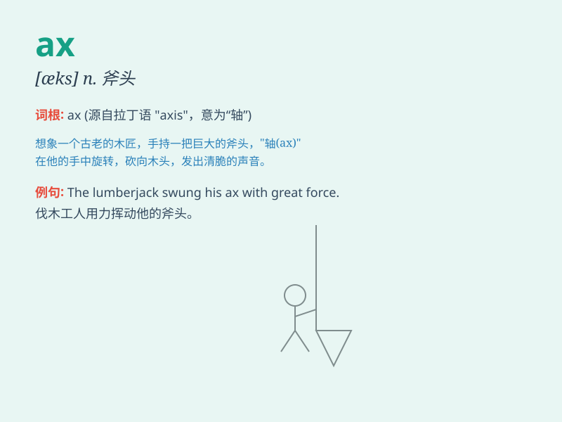

## ax

**英音:** _[æks]_ **美音:** _[æks]_

**译义:** *n.斧头vt.削减*

### 短语

+ **ax handle:** _斧柄_

+ **ice ax:** _冰镐_

+ **ax blade:** _斧刃_

+ **wood ax:** _伐木斧_

+ **ax head:** _斧头_

### 例句

#### 例句1

> **He chopped the wood with an ax.**

**中文翻译:** 他用斧头砍柴。

**单词释义:** 斧头

#### 例句2

> **The criminal was threatened with the ax of justice.**

**中文翻译:** 罪犯受到了正义的惩罚威胁。

**单词释义:** 惩罚；制裁

#### 例句3

> **The company is facing the ax due to financial difficulties.**

**中文翻译:** 由于财务困难，这家公司面临被裁减的命运。

**单词释义:** 裁减；削减

### 背诵小故事

> A woodcutter was lost in the forest. He needed an ax to cut down
trees and make a path. Finally, he found the ax and safely returned
home. The ax was his savior.

**一位伐木工在森林里迷路了。他需要一把斧头来砍树并开辟道路。最后，他找到了斧头，安全地回了家。斧头是他的救星。**

### 图义

