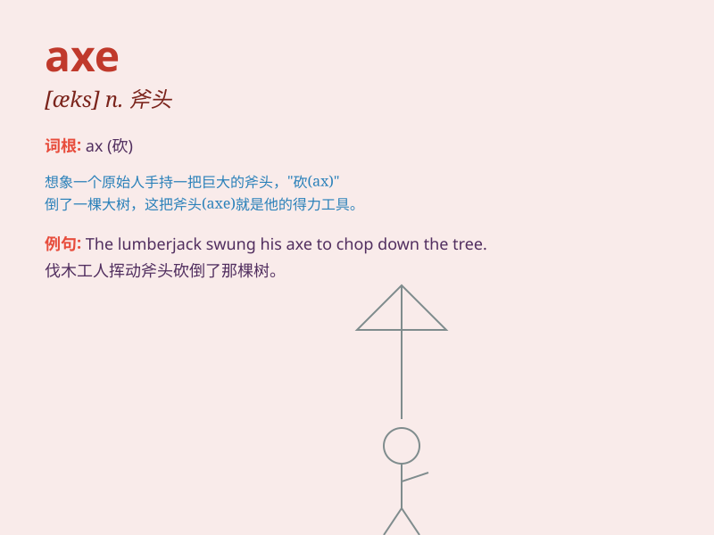

## axe

**英音:** _[æks]_ **美音:** _[æks]_

**译义:** *n.斧,(经费的)大削减*

### 短语

+ **axe murder:** _用斧头杀人_

+ **axe handle:** _斧柄_

+ **get the axe:** _被解雇；被淘汰_

+ **axe to grind:** _别有用心；另有企图_

+ **an axe to fall:** _厄运临头_

### 例句

#### 例句1

> **The company decided to axe the unprofitable project.**

**中文翻译:** 公司决定砍掉不盈利的项目。

**单词释义:** 砍掉；削减

#### 例句2

> **He was axed from his job last month.**

**中文翻译:** 他上个月被解雇了。

**单词释义:** 解雇；开除

#### 例句3

> **The government is planning to axe public spending.**

**中文翻译:** 政府正计划削减公共开支。

**单词释义:** 削减；减少

### 背诵小故事

> Once upon a time, a brave woodcutter was in the forest. He used an
axe to chop down big trees and make firewood. The axe was his powerful
tool, helping him complete his work easily.

**从前，有一个勇敢的伐木工在森林里。他用一把斧头砍倒大树并制作木柴。斧头是他强大的工具，帮助他轻松完成工作。**

### 图义

