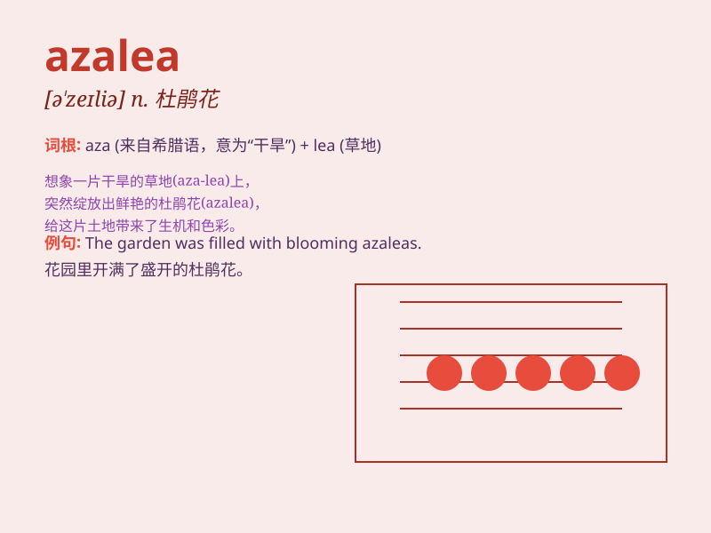

## azalea

**英音:** _[ə\'zeɪlɪə]_ **美音:** _[ə\'zelɪə]_

**译义:** *n.[植]杜鹃花*

### 短语

+ **azalea bush:** _杜鹃花灌木丛_

+ **white azalea:** _白色的杜鹃花_

+ **azalea garden:** _杜鹃花花园_

+ **azalea flower:** _杜鹃花花朵_

+ **pink azalea:** _粉色的杜鹃花_

### 例句

#### 例句1

> **The garden was filled with beautiful azaleas in full bloom.**

**中文翻译:** 花园里满是盛开的美丽杜鹃花。

**单词释义:** 杜鹃花

#### 例句2

> **She received a bouquet of azaleas on her birthday.**

**中文翻译:** 她生日时收到了一束杜鹃花。

**单词释义:** 杜鹃花

#### 例句3

> **The hillside was covered with a carpet of azaleas.**

**中文翻译:** 山坡上铺满了一层杜鹃花。

**单词释义:** 杜鹃花

### 背诵小故事

> One day, a little girl was walking in the garden and saw a beautiful
azalea. The flower was so bright and charming that it made her smile.
She remembered the name \'azalea\' because of its unforgettable beauty.

**有一天，一个小女孩在花园里散步，看到了一朵美丽的杜鹃花。这朵花如此明艳动人，让她露出了笑容。她记住了'azalea'这个名字，就因为它那令人难忘的美丽。**

### 图义

