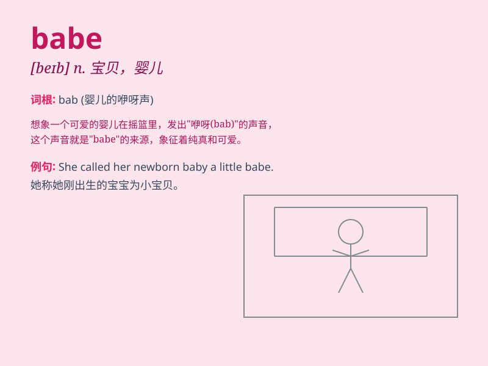

## babe

**英音:** _[beɪb]_ **美音:** _[beɪb]_

**译义:** *n.小孩,缺乏经验的人*

### 短语

+ **babe in the woods:** _天真无邪的人；初出茅庐的人_

+ **babe magnet:** _吸引异性的人_

+ **babe of fortune:** _幸运儿_

+ **babe in arms:** _怀抱中的婴儿_

+ **babe in the world:** _涉世未深的人_

### 例句

#### 例句1

> **The babe in the crib was sleeping peacefully.**

**中文翻译:** 婴儿床里的婴儿正在安静地睡觉。

**单词释义:** 婴儿

#### 例句2

> **He called her babe as a term of endearment.**

**中文翻译:** 他称呼她为宝贝，作为一种爱称。

**单词释义:** 宝贝（爱称）

#### 例句3

> **She\'s a real babe, attracting everyone\'s attention.**

**中文翻译:** 她真是个迷人的姑娘，吸引着每个人的注意。

**单词释义:** 姑娘；迷人的女子

### 背诵小故事

> A young man was lost in the forest. Feeling scared and alone, he
suddenly heard a soft voice calling \'Babe!\' It was a kind fairy who
came to help him. The man remembered \'babe\' as the comforting voice in
his time of need.

**一个年轻人在森林里迷路了。感到害怕和孤独时，他突然听到一个轻柔的声音叫着'宝贝！'原来是一位善良的仙女来帮助他。这个男人记住了'babe'就是在他需要时那令人安慰的声音。**

### 图义

