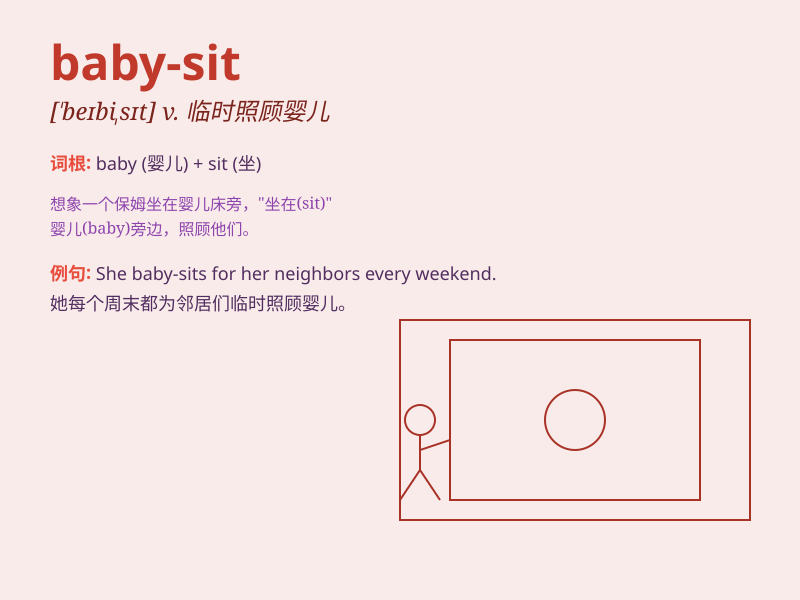

## baby-sit

**英音:** _[ˈbeɪbi sɪt]_ **美音:** _[ˈbeɪbi sɪt]_

**译义:** *vi. 临时替人看小孩；当临时保姆*

### 短语

+ **baby-sit for:** _替\...临时照看婴儿_

+ **baby-sit someone:** _照看某人_

+ **go baby-sitting:** _去当临时保姆_

+ **hire a baby-sitter:** _雇一个临时保姆_

+ **be on baby-sitting duty:** _负责照看婴儿_

### 例句

#### 例句1

> **I\'m going to baby-sit for my neighbor this weekend.**

**中文翻译:** 这个周末我要去给我的邻居照看孩子。

**单词释义:** 临时照看小孩

#### 例句2

> **She often baby-sits her cousin\'s children.**

**中文翻译:** 她经常照看她表弟的孩子。

**单词释义:** 照顾幼儿

#### 例句3

> **My sister is baby-sitting at their house tonight.**

**中文翻译:** 我姐姐今晚在他们家看孩子。

**单词释义:** 当临时保姆

### 背诵小故事

> One day, a girl named Lily was asked to baby-sit her neighbor\'s
little kids. She played with them, fed them, and made sure they were
safe. It was a fun but also responsible job for Lily.

**有一天，一个叫莉莉的女孩被要求照看邻居家的小孩子。她和他们一起玩，给他们喂食，并确保他们的安全。对莉莉来说，这是一份有趣但也责任重大的工作。**

### 图义

