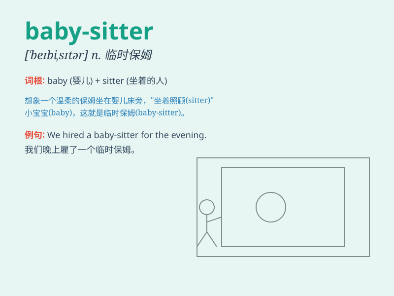

## baby-sitter

**英音:** _[ˈbeɪbi sɪtə(r)]_ **美音:** _[ˈbeɪbi sɪtər]_

**译义:** *n.临时照顾小孩的人，保姆*

### 短语

+ **professional baby-sitter:** _专业保姆_

+ **experienced baby-sitter:** _经验丰富的保姆_

+ **part-time baby-sitter:** _兼职保姆_

+ **reliable baby-sitter:** _可靠的保姆_

+ **live-in baby-sitter:** _住家保姆_

### 例句

#### 例句1

> **I need to find a reliable baby-sitter for this weekend.**

**中文翻译:** 我这个周末需要找一个可靠的临时保姆。

**单词释义:** 临时保姆

#### 例句2

> **The baby-sitter arrived on time and the kids were happy to see
her.**

**中文翻译:** 临时保姆按时到了，孩子们见到她很高兴。

**单词释义:** 临时保姆

#### 例句3

> **We hired a baby-sitter to take care of the children while we were
at the party.**

**中文翻译:** 我们在参加聚会时雇了一个临时保姆来照顾孩子。

**单词释义:** 临时保姆

### 背诵小故事

> One day, a busy family needed someone to look after their baby. So
they hired a baby-sitter. The baby-sitter played with the baby, fed it,
and made sure it was safe and happy.

**有一天，一个忙碌的家庭需要有人照顾他们的宝宝。于是他们雇了一个临时保姆。这个临时保姆和宝宝一起玩耍，给宝宝喂食，确保宝宝安全快乐。**

### 图义

