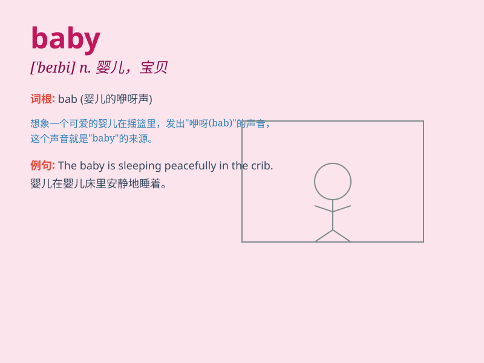

## baby

**英音:** _[\'beɪbɪ]_ **美音:** _[bebɪ]_

**译义:** *n.婴孩*

### 短语

+ **baby sitter:** _临时保姆；照顾婴孩者_

+ **baby carriage:** _婴儿车_

+ **baby food:** _婴儿食品_

+ **have a baby:** _生孩子；有孩子_

+ **baby teeth:** _乳牙_

### 例句

#### 例句1

> **The baby is sleeping peacefully in the crib.**

**中文翻译:** 这个婴儿正在婴儿床里安静地睡觉。

**单词释义:** 婴儿

#### 例句2

> **She treats her dog like a baby.**

**中文翻译:** 她把她的狗当作宝贝一样对待。

**单词释义:** 宝贝；心肝

#### 例句3

> **Don\'t be such a baby! You can do it.**

**中文翻译:** 别这么孩子气！你能做到的。

**单词释义:** 孩子气的人

### 背诵小故事

> A cute little baby was sleeping peacefully in a crib. Suddenly, it
woke up and started crying. Mom quickly came and held the baby gently,
making it smile again. The baby is so precious and needs love and care.

**一个可爱的小婴儿正在婴儿床里安静地睡觉。突然，它醒了并开始哭。妈妈很快过来，轻轻地抱着婴儿，让它再次笑了起来。婴儿是如此珍贵，需要爱和关怀。**

### 图义

