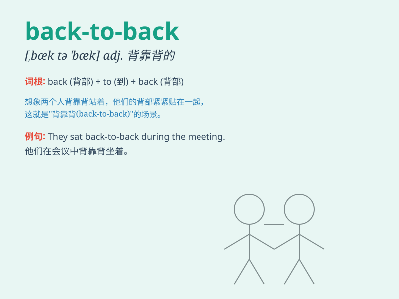

## back-to-back

**英音:** _[bækˈtʊbæk]_ **美音:** _[bækˈtʊbæk]_

**译义:**
*adj.背靠背的；连续不断的；n.背靠背的比赛或活动；连续的事情或人*

### 短语

+ **back-to-back wins:** _连续的胜利_

+ **back-to-back meetings:** _一个接一个的会议_

+ **back-to-back championships:** _连续的冠军_

+ **back-to-back performances:** _连续的表演_

+ **back-to-back home runs:** _连续的本垒打_

### 例句

#### 例句1

> **The team won two back-to-back championships.**

**中文翻译:** 这个团队连续赢得了两个冠军。

**单词释义:** 连续的

#### 例句2

> **We had back-to-back meetings all day.**

**中文翻译:** 我们一整天都有接连不断的会议。

**单词释义:** 接连不断的

#### 例句3

> **They achieved back-to-back victories in the competition.**

**中文翻译:** 他们在比赛中取得了连续的胜利。

**单词释义:** 连续的

### 背诵小故事

> One day, Tom and Jerry had a back-to-back race. They stood
back-to-back and started running in opposite directions. It was so
funny! They were like two arrows shooting away from each other.

**有一天，汤姆和杰瑞进行了一场背靠背的比赛。他们背靠背站着，然后朝相反的方向开始跑。太有趣了！他们就像两支朝彼此相反方向射出的箭。**

### 图义

