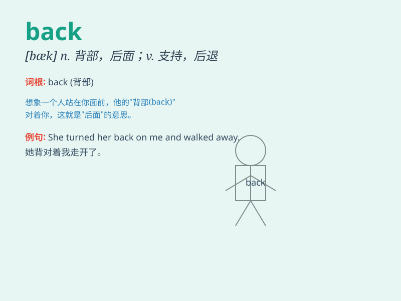

## back

**英音:** _[bæk]_ **美音:** _[bæk]_

**译义:**
*adj.后面的,在后面,早过去的,前(欠)的钱adv.向后地n.背部,后面v.后退,支持*

### 短语

+ **back and forth:** _来回地；反复地_

+ **back up:** _支持；倒退；备份_

+ **turn one\'s back on:** _不理睬；背弃_

+ **put one\'s back into:** _全力以赴；努力从事_

+ **at the back of:** _在......的后面；作为......的原因_

### 例句

#### 例句1

> **I turned my back on him and walked away.**

**中文翻译:** 我转身背对着他走开了。

**单词释义:** 背部

#### 例句2

> **Please back the car into the garage.**

**中文翻译:** 请把车倒进车库。

**单词释义:** 使后退；倒车

#### 例句3

> **I\'ll always have your back.**

**中文翻译:** 我会一直支持你的。

**单词释义:** 支持；帮助

### 背诵小故事

> One day, I was lost in a strange city. I had no idea where to go.
Suddenly, I saw a sign that pointed back to my hotel. I followed it and
finally got back safely.

**有一天，我在一个陌生的城市迷路了。我不知道该往哪儿走。突然，我看到一个指向我酒店的标志，写着"back"。我跟着它，最后安全地回去了。**

### 图义

