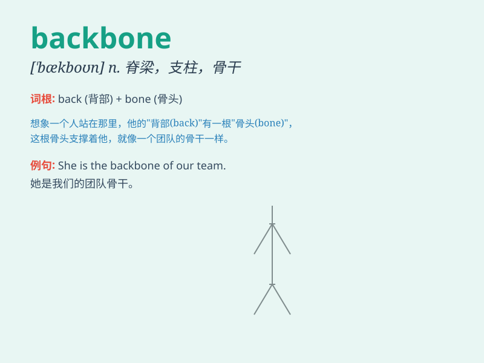

## backbone

**英音:** _[\'bækbəʊn]_ **美音:** _[\'bæk\'bon]_

**译义:** *n.脊椎,中枢,骨干,支柱,意志力,勇气,毅力,决心;骨干网*

### 短语

+ **have a backbone:** _有骨气；有胆量_

+ **the backbone of something:** _某物的支柱；某物的骨干_

+ **show backbone:** _表现出骨气_

+ **lack backbone:** _缺乏骨气_

+ **stiffen one\'s backbone:** _使自己坚强起来_

### 例句

#### 例句1

> **The backbone of the economy is the manufacturing industry.**

**中文翻译:** 经济的支柱是制造业。

**单词释义:** 支柱；骨干

#### 例句2

> **He showed a lot of backbone in the face of difficulties.**

**中文翻译:** 面对困难，他表现出了很大的勇气。

**单词释义:** 勇气；决心

#### 例句3

> **The mountain range forms the backbone of the country.**

**中文翻译:** 山脉构成了国家的脊梁。

**单词释义:** 脊梁；脊柱

### 背诵小故事

> A superhero was fighting villains. But he got injured and fell. Just
when all seemed lost, he remembered his backbone, the inner strength
that never gave up. With that, he stood up and defeated the villains.

**一位超级英雄正在与坏人战斗。但他受伤倒下了。就在一切似乎无望时，他想起了自己的脊梁，那种永不放弃的内在力量。凭借此，他站起来并打败了坏人。**

### 图义

