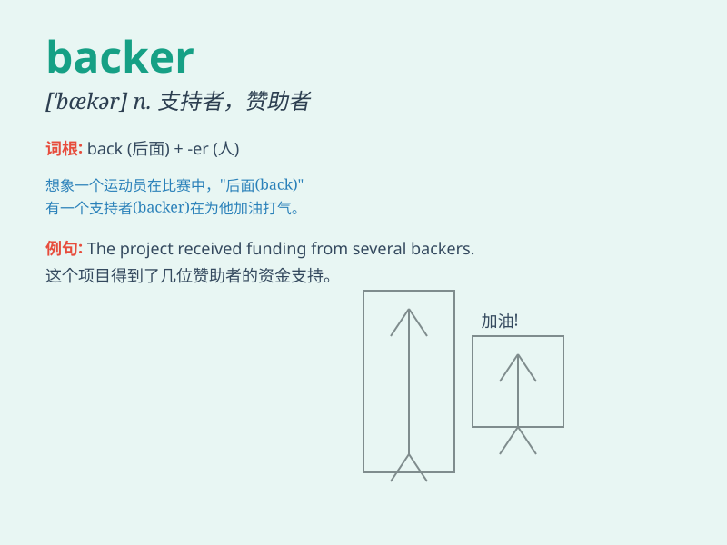

## backer

**英音:** _[\'bækə(r)]_ **美音:** _[\'bækɚ]_

**译义:** *n.支持者*

### 短语

+ **financial backer:** _金融支持者；财务赞助者_

+ **major backer:** _主要支持者_

+ **political backer:** _政治支持者_

+ **loyal backer:** _忠实的支持者_

+ **potential backer:** _潜在的支持者_

### 例句

#### 例句1

> **The project has a wealthy backer who is willing to invest a large
sum of money.**

**中文翻译:** 该项目有一位富有的支持者，愿意投入大量资金。

**单词释义:** 资助者；支持者

#### 例句2

> **He became the main backer of the local football team.**

**中文翻译:** 他成为当地足球队的主要支持者。

**单词释义:** 支持者

#### 例句3

> **The politician has many powerful backers behind him.**

**中文翻译:** 这位政客背后有许多强大的支持者。

**单词释义:** 支持者；赞助者

### 背诵小故事

> Imagine a big music concert. The singer was amazing, but needed
financial support. Then came a rich man who believed in the singer\'s
talent and provided the money. This rich man was the backer, giving
crucial support behind the scenes.

**想象一场大型音乐会。歌手很棒，但需要资金支持。这时来了一位富人，他相信歌手的才华并提供了资金。这位富人就是赞助者，在幕后给予了关键的支持。**

### 图义

